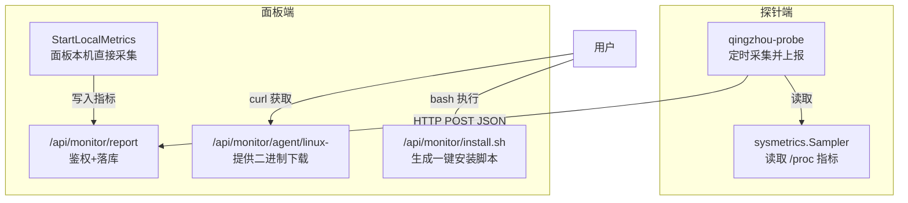
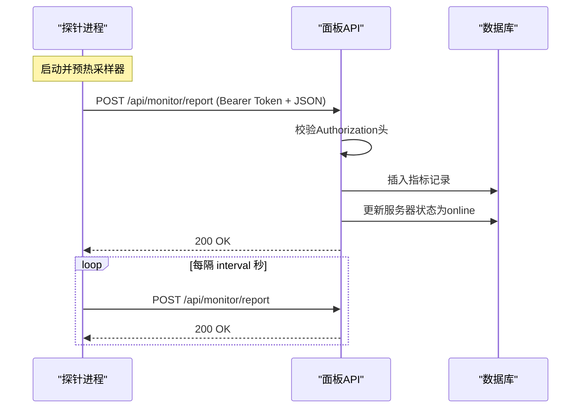
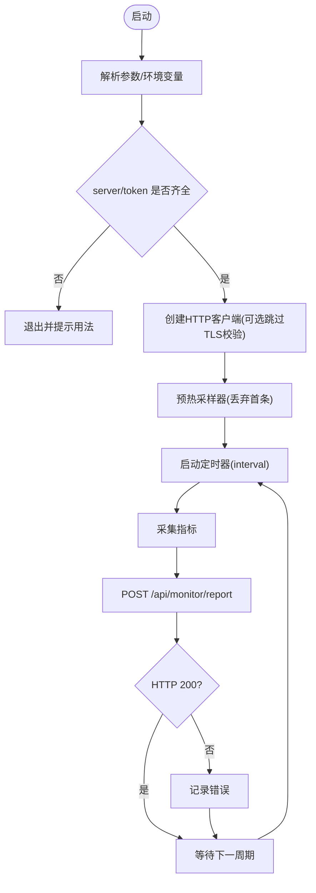
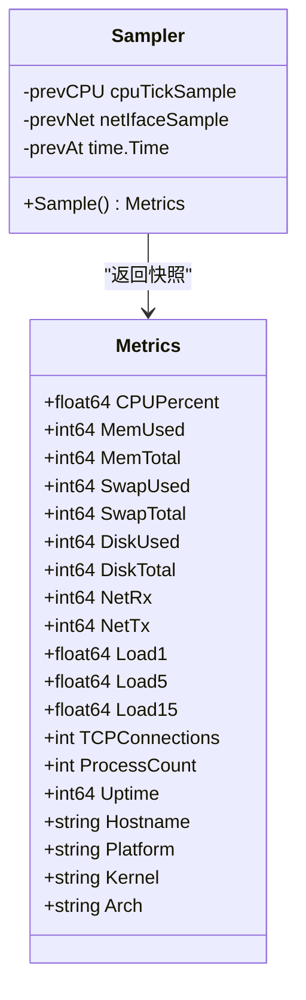
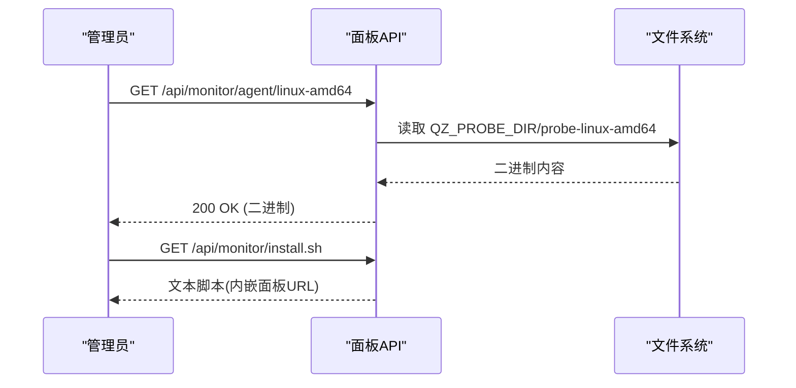
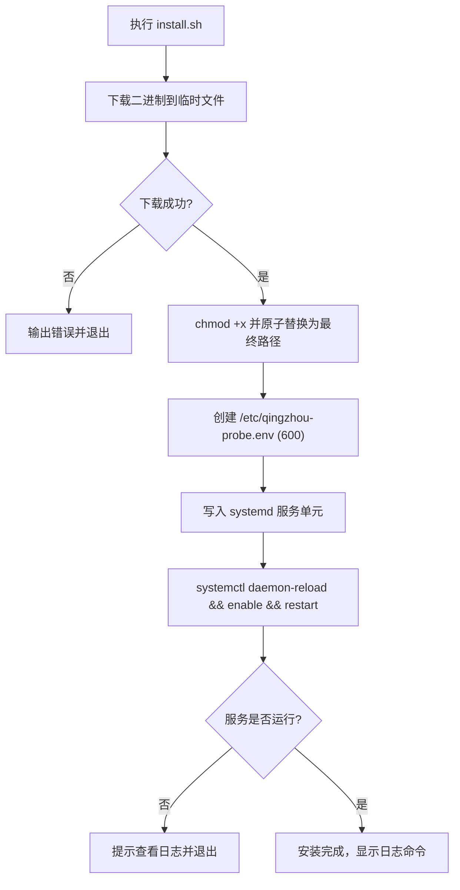
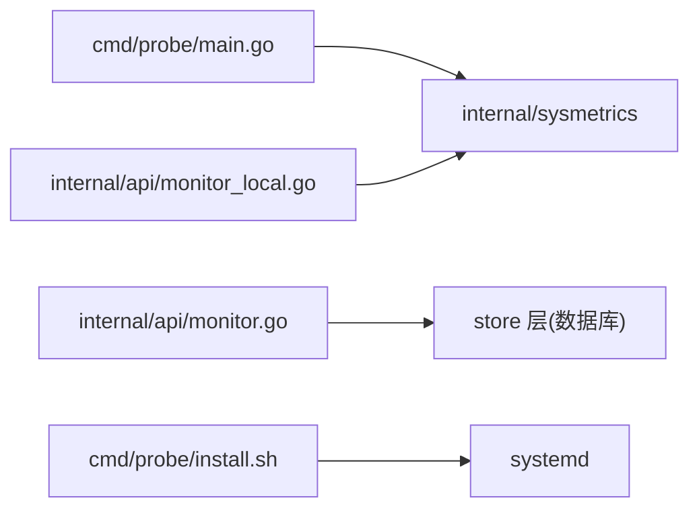

# 探针系统

<cite>
**本文引用的文件**
- [cmd/probe/main.go](file://cmd/probe/main.go)
- [cmd/probe/install.sh](file://cmd/probe/install.sh)
- [cmd/probe/build.sh](file://cmd/probe/build.sh)
- [internal/sysmetrics/sysmetrics.go](file://internal/sysmetrics/sysmetrics.go)
- [internal/sysmetrics/sysmetrics_linux.go](file://internal/sysmetrics/sysmetrics_linux.go)
- [internal/api/monitor.go](file://internal/api/monitor.go)
- [internal/api/monitor_local.go](file://internal/api/monitor_local.go)
- [deploy/qingzhou.service](file://deploy/qingzhou.service)
- [deploy/qingzhou.env.example](file://deploy/qingzhou.env.example)
- [docs/部署与配置手册.md](file://docs/部署与配置手册.md)
</cite>

## 目录
1. [简介](#简介)
2. [项目结构](#项目结构)
3. [核心组件](#核心组件)
4. [架构总览](#架构总览)
5. [详细组件分析](#详细组件分析)
6. [依赖关系分析](#依赖关系分析)
7. [性能考虑](#性能考虑)
8. [故障排查指南](#故障排查指南)
9. [结论](#结论)
10. [附录：安装与配置速查](#附录安装与配置速查)

## 简介
轻舟面板探针是一个轻量级 Linux 监控代理，负责采集本机 CPU、内存、磁盘、网络、负载、TCP 连接数、进程数、运行时长等指标，并通过 HTTP POST 上报到面板的 /api/monitor/report。探针支持通过命令行参数或环境变量配置面板地址与认证令牌，默认每 30 秒上报一次，首次采样会预热以避免首条数据失真。

## 项目结构
探针相关代码与脚本主要分布在以下位置：
- 探针程序入口与主循环：cmd/probe/main.go
- 一键安装脚本（本地可执行）：cmd/probe/install.sh
- 交叉编译脚本（构建 amd64/arm64 二进制）：cmd/probe/build.sh
- 指标采集核心库（跨平台逻辑 + Linux 实现）：internal/sysmetrics/*
- 面板侧探针接收与下载接口：internal/api/monitor.go
- 面板本机直接采集（无需探针）：internal/api/monitor_local.go
- 面板 systemd 服务与环境变量示例：deploy/qingzhou.service, deploy/qingzhou.env.example
- 部署与配置手册（含探针章节）：docs/部署与配置手册.md

图表来源
- [cmd/probe/main.go:34-91](file://cmd/probe/main.go#L34-L91)
- [internal/sysmetrics/sysmetrics.go:16-38](file://internal/sysmetrics/sysmetrics.go#L16-L38)
- [internal/api/monitor.go:20-73](file://internal/api/monitor.go#L20-L73)
- [internal/api/monitor_local.go:33-69](file://internal/api/monitor_local.go#L33-L69)

章节来源
- [cmd/probe/main.go:1-119](file://cmd/probe/main.go#L1-L119)
- [cmd/probe/install.sh:1-116](file://cmd/probe/install.sh#L1-L116)
- [cmd/probe/build.sh:1-16](file://cmd/probe/build.sh#L1-L16)
- [internal/sysmetrics/sysmetrics.go:1-110](file://internal/sysmetrics/sysmetrics.go#L1-L110)
- [internal/sysmetrics/sysmetrics_linux.go:1-338](file://internal/sysmetrics/sysmetrics_linux.go#L1-L338)
- [internal/api/monitor.go:1-920](file://internal/api/monitor.go#L1-L920)
- [internal/api/monitor_local.go:1-131](file://internal/api/monitor_local.go#L1-L131)
- [deploy/qingzhou.service:1-22](file://deploy/qingzhou.service#L1-L22)
- [deploy/qingzhou.env.example:1-43](file://deploy/qingzhou.env.example#L1-L43)
- [docs/部署与配置手册.md:1-261](file://docs/部署与配置手册.md#L1-L261)

## 核心组件
- 探针主程序：解析参数与环境变量，构造 HTTP 客户端，周期性采集并上报指标。
- 指标采集器：从 /proc 读取 CPU、内存、磁盘、网络、负载、TCP 连接、进程数、运行时长、主机信息等。
- 面板接收端：校验 Bearer Token，解析 JSON，写入数据库，更新服务器在线状态。
- 面板本机采集：在面板启动时即开始采集本机指标，无需额外探针。
- 安装与分发：提供二进制下载与一键安装脚本，自动创建 systemd 服务与环境文件。

章节来源
- [cmd/probe/main.go:27-91](file://cmd/probe/main.go#L27-L91)
- [internal/sysmetrics/sysmetrics.go:16-38](file://internal/sysmetrics/sysmetrics.go#L16-L38)
- [internal/sysmetrics/sysmetrics_linux.go:20-65](file://internal/sysmetrics/sysmetrics_linux.go#L20-L65)
- [internal/api/monitor.go:20-55](file://internal/api/monitor.go#L20-L55)
- [internal/api/monitor_local.go:33-69](file://internal/api/monitor_local.go#L33-L69)

## 架构总览
探针与面板的通信采用无状态的 HTTP POST + Bearer Token 认证。探针按固定间隔采集指标，将 Metrics 结构序列化为 JSON 上报；面板验证 Token 后持久化指标并更新服务器在线状态。面板同时提供二进制下载和一键安装脚本，便于快速部署。

图表来源
- [cmd/probe/main.go:64-91](file://cmd/probe/main.go#L64-L91)
- [internal/api/monitor.go:20-55](file://internal/api/monitor.go#L20-L55)

## 详细组件分析

### 探针主程序（cmd/probe/main.go）
- 参数与环境变量：
  - server：面板地址（必填），可从 -server 或 QZ_PROBE_SERVER 获取
  - token：认证令牌（必填），可从 -token 或 QZ_PROBE_TOKEN 获取
  - interval：采集间隔（秒，默认 30，最小 5）
  - insecure：跳过 TLS 证书校验（仅测试用）
- 行为要点：
  - 首次调用 Sampler.Sample() 进行预热，避免首条 CPU/网络速度为零
  - 使用 time.Ticker 控制上报频率
  - 请求头包含 Authorization: Bearer <token>
  - 非 200 响应视为失败并记录日志

图表来源
- [cmd/probe/main.go:34-91](file://cmd/probe/main.go#L34-L91)

章节来源
- [cmd/probe/main.go:27-119](file://cmd/probe/main.go#L27-L119)

### 指标采集器（internal/sysmetrics）
- 数据结构 Metrics：包含 CPU%、内存使用/总量、Swap、磁盘使用/总量、网络收发速率、负载均值、TCP 连接数、进程数、运行时长、主机名、平台、内核、架构等。
- 算法要点：
  - CPU%：基于两次 /proc/stat 的 tick 差值计算
  - 网络速率：基于两次 /proc/net/dev 的 rx/tx 差值除以时间间隔
  - 磁盘统计：聚合真实块设备文件系统，排除伪文件系统
  - TCP 连接：统计 /proc/net/tcp 与 tcp6 中 ESTABLISHED 状态
  - 进程数：统计 /proc 下数字目录数量
  - 运行时长：读取 /proc/uptime
- 平台差异：Linux 专用实现位于 sysmetrics_linux.go；其他平台由通用逻辑与 Supported() 控制。

图表来源
- [internal/sysmetrics/sysmetrics.go:16-38](file://internal/sysmetrics/sysmetrics.go#L16-L38)
- [internal/sysmetrics/sysmetrics_linux.go:20-65](file://internal/sysmetrics/sysmetrics_linux.go#L20-L65)

章节来源
- [internal/sysmetrics/sysmetrics.go:1-110](file://internal/sysmetrics/sysmetrics.go#L1-L110)
- [internal/sysmetrics/sysmetrics_linux.go:1-338](file://internal/sysmetrics/sysmetrics_linux.go#L1-L338)

### 面板接收与分发（internal/api/monitor.go）
- 报告接口 /api/monitor/report：
  - 从 Authorization 头提取 Bearer Token
  - 根据 Token 查找服务器，不存在则拒绝
  - 解析 JSON 为 ServerMetrics 并写入数据库
  - 更新服务器状态为 online，记录最近上报时间
- 二进制下载 /api/monitor/agent/linux-<arch>：
  - 支持 linux-amd64 与 linux-arm64
  - 优先使用 QZ_PROBE_DIR 环境变量指定的目录，否则回退到 cmd/probe/dist
- 安装脚本 /api/monitor/install.sh：
  - 动态生成带面板地址的一键安装脚本，供目标机器执行

图表来源
- [internal/api/monitor.go:57-73](file://internal/api/monitor.go#L57-L73)
- [internal/api/monitor.go:75-179](file://internal/api/monitor.go#L75-L179)

章节来源
- [internal/api/monitor.go:1-920](file://internal/api/monitor.go#L1-L920)

### 面板本机采集（internal/api/monitor_local.go）
- 启动时开启后台协程，以 30 秒间隔采集本机指标并写入数据库
- 不使用探针二进制、Token 或 systemd 单元
- 可将本机作为“本地节点”参与监控视图，受公共可见性设置控制

章节来源
- [internal/api/monitor_local.go:1-131](file://internal/api/monitor_local.go#L1-L131)

### 安装与部署（cmd/probe/install.sh）
- 功能：
  - 检测架构并下载对应二进制（amd64/arm64）
  - 原子替换二进制（避免覆盖正在运行的文件导致 ETXTBSY）
  - 创建安全的环境配置文件 /etc/qingzhou-probe.env（权限 600）
  - 创建 systemd 服务单元并启用自启
  - 启动服务并检查运行状态
- 环境变量：
  - QZ_PROBE_SERVER：面板地址
  - QZ_PROBE_TOKEN：探针认证令牌

图表来源
- [cmd/probe/install.sh:1-116](file://cmd/probe/install.sh#L1-L116)

章节来源
- [cmd/probe/install.sh:1-116](file://cmd/probe/install.sh#L1-L116)

### 构建与分发（cmd/probe/build.sh）
- 交叉编译生成 probe-linux-amd64 与 probe-linux-arm64
- 输出至 cmd/probe/dist，供面板通过 /api/monitor/agent 提供下载

章节来源
- [cmd/probe/build.sh:1-16](file://cmd/probe/build.sh#L1-L16)

## 依赖关系分析
- 探针依赖 sysmetrics 包进行指标采集
- 面板 monitor 模块依赖 store 层进行指标持久化与查询
- 面板本机采集同样复用 sysmetrics，保证数据口径一致
- 安装脚本依赖 curl/wget 与 systemd

图表来源
- [cmd/probe/main.go:24-25](file://cmd/probe/main.go#L24-L25)
- [internal/api/monitor.go:14-16](file://internal/api/monitor.go#L14-L16)
- [internal/api/monitor_local.go:8-10](file://internal/api/monitor_local.go#L8-L10)
- [cmd/probe/install.sh:98-101](file://cmd/probe/install.sh#L98-L101)

章节来源
- [cmd/probe/main.go:12-25](file://cmd/probe/main.go#L12-L25)
- [internal/api/monitor.go:1-16](file://internal/api/monitor.go#L1-L16)
- [internal/api/monitor_local.go:1-10](file://internal/api/monitor_local.go#L1-L10)
- [cmd/probe/install.sh:98-101](file://cmd/probe/install.sh#L98-L101)

## 性能考虑
- 采集间隔：默认 30 秒，可通过 -interval 调整，最小 5 秒。更短间隔会增加面板写入压力与网络开销。
- 指标计算：CPU% 与网络速率均为差值计算，需保持 Sampler 实例生命周期内复用，避免首条失真。
- 磁盘统计：排除伪文件系统，避免重复计数与虚高占用。
- 网络接口过滤：仅统计物理网卡前缀（如 eth、ens、enp、wlan、em、eno），忽略回环与隧道设备。
- 面板存储：指标写入数据库，建议结合保留策略与归档机制控制历史数据规模。
- 传输安全：生产环境务必启用 HTTPS，避免使用 -insecure。

[本节为通用指导，不直接分析具体文件]

## 故障排查指南
- 探针无法启动或立即退出：
  - 检查 QZ_PROBE_SERVER 与 QZ_PROBE_TOKEN 是否正确设置
  - 确认面板地址可达且 /api/monitor/report 端口开放
  - 查看 systemd 日志：journalctl -u qingzhou-probe -f
- 上报失败（非 200）：
  - 检查面板日志与数据库写入是否正常
  - 确认 Token 已启用且与服务器绑定正确
- 指标异常（CPU/网络为 0）：
  - 确认首次采样已预热（主程序已处理）
  - 检查 /proc 可读性与权限
- 安装脚本失败：
  - 确认 curl/wget 可用
  - 检查 /api/monitor/agent/linux-<arch> 是否返回 200
  - 若 404，需在面板设置 QZ_PROBE_DIR 指向包含二进制的目录
- 面板本机监控不可见：
  - 检查公共可见性设置（monitor_local_public）
  - 确认 StartLocalMetrics 已启动并写入指标

章节来源
- [cmd/probe/main.go:37-62](file://cmd/probe/main.go#L37-L62)
- [cmd/probe/install.sh:37-66](file://cmd/probe/install.sh#L37-L66)
- [internal/api/monitor.go:20-55](file://internal/api/monitor.go#L20-L55)
- [internal/api/monitor_local.go:33-69](file://internal/api/monitor_local.go#L33-L69)
- [docs/部署与配置手册.md:210-221](file://docs/部署与配置手册.md#L210-L221)

## 结论
轻舟探针以极简设计实现了可靠的系统指标采集与上报，配合面板的鉴权、存储与可视化能力，形成完整的监控闭环。通过一键安装脚本与 systemd 管理，部署与维护成本低；通过合理的采集间隔与指标计算策略，兼顾准确性与性能。生产环境应严格使用 HTTPS 与安全的 Token 管理，并结合面板告警阈值实现主动运维。

[本节为总结，不直接分析具体文件]

## 附录：安装与配置速查
- 一键安装（在目标机器执行）：
  - 从面板获取安装命令，形如：bash <(curl -sL <面板地址>/api/monitor/install.sh) <探针Token>
  - 脚本会自动下载二进制、创建环境文件与服务单元并启动
- 手动安装步骤：
  - 下载二进制到 /usr/local/bin/qingzhou-probe
  - 创建 /etc/qingzhou-probe.env（QZ_PROBE_SERVER、QZ_PROBE_TOKEN），权限 600
  - 创建 systemd 服务单元（参考仓库中的模板）
  - systemctl daemon-reload && enable --now qingzhou-probe
- 环境变量说明：
  - QZ_PROBE_SERVER：面板地址（必填）
  - QZ_PROBE_TOKEN：探针认证令牌（必填）
  - 其他：interval、insecure 等通过命令行参数传入
- 面板侧配置：
  - 设置 QZ_PROBE_DIR 指向包含 probe-linux-amd64 与 probe-linux-arm64 的目录
  - 在“监控管理”页启用探针并获取 Token
  - 配置告警阈值（CPU/内存/磁盘）

章节来源
- [cmd/probe/install.sh:1-116](file://cmd/probe/install.sh#L1-L116)
- [deploy/qingzhou.service:1-22](file://deploy/qingzhou.service#L1-L22)
- [deploy/qingzhou.env.example:15-20](file://deploy/qingzhou.env.example#L15-L20)
- [docs/部署与配置手册.md:210-221](file://docs/部署与配置手册.md#L210-L221)
