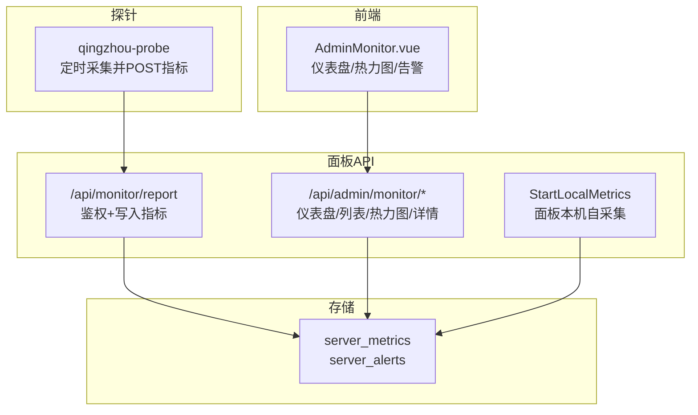
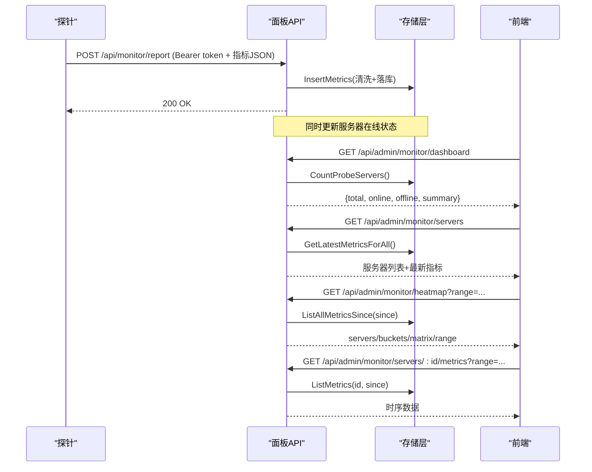
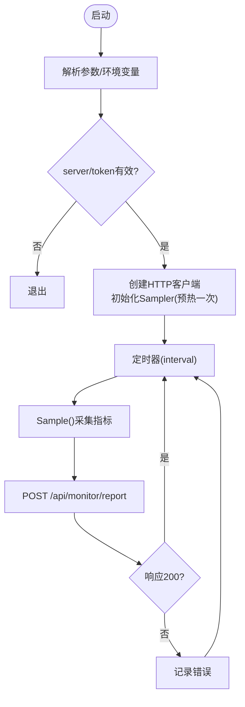
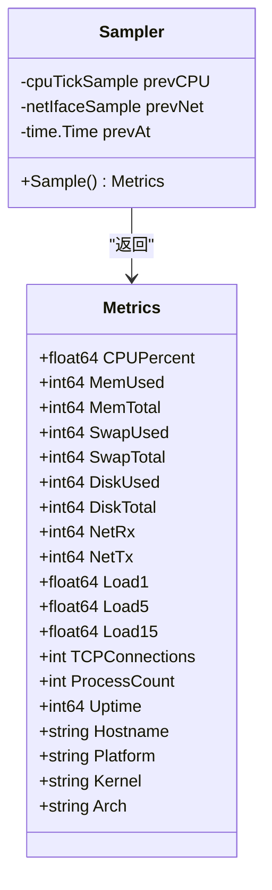
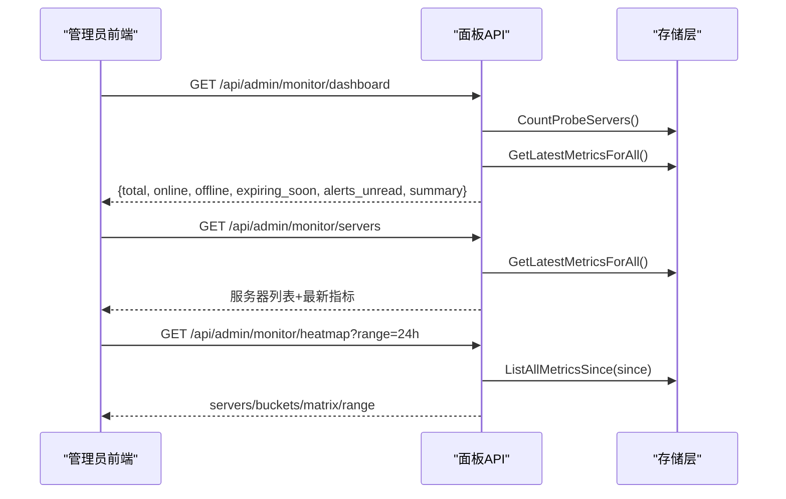
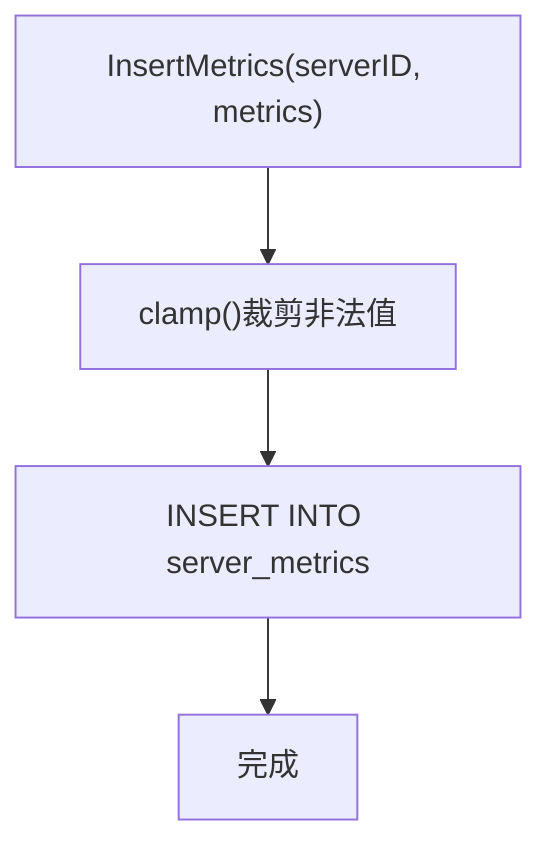
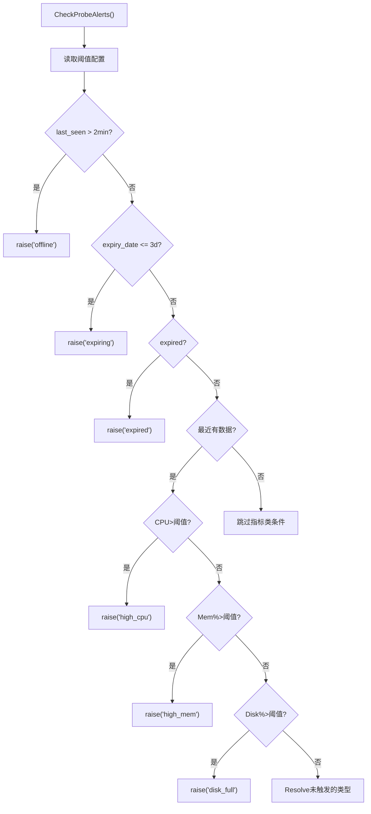
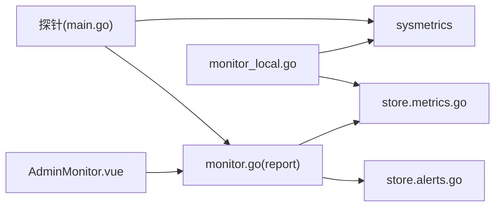

# 监控告警

<cite>
**本文引用的文件**
- [main.go](file://cmd/probe/main.go)
- [monitor.go](file://internal/api/monitor.go)
- [monitor_local.go](file://internal/api/monitor_local.go)
- [sysmetrics.go](file://internal/sysmetrics/sysmetrics.go)
- [sysmetrics_linux.go](file://internal/sysmetrics/sysmetrics_linux.go)
- [alerts.go](file://internal/store/alerts.go)
- [metrics.go](file://internal/store/metrics.go)
- [AdminMonitor.vue](file://frontend/src/views/AdminMonitor.vue)
- [qingzhou.env.example](file://deploy/qingzhou.env.example)
- [config.go](file://internal/config/config.go)
- [email.go](file://internal/api/email.go)
</cite>

## 目录
1. [简介](#简介)
2. [项目结构](#项目结构)
3. [核心组件](#核心组件)
4. [架构总览](#架构总览)
5. [详细组件分析](#详细组件分析)
6. [依赖关系分析](#依赖关系分析)
7. [性能考虑](#性能考虑)
8. [故障排查指南](#故障排查指南)
9. [结论](#结论)
10. [附录](#附录)

## 简介
本文件为轻舟面板的“监控告警”子系统技术文档，覆盖以下目标：
- 内置监控系统的工作原理与数据采集机制
- 探针程序的部署方式、功能与指标采集项
- 告警规则配置与管理（阈值、通知渠道、告警升级策略）
- 监控数据的查看与分析方法（仪表板、热力图、数据导出）
- 监控对系统性能的影响及优化建议
- 告警事件处理流程与故障诊断方法

## 项目结构
监控告警相关代码主要分布在如下模块：
- 探针程序：独立可执行，负责采集系统指标并通过 HTTP 上报
- 面板后端 API：接收探针上报、提供管理端查询、生成热力图与统计
- 本地采集：面板自身也作为一台被监控机器，直接读取 /proc
- 存储层：指标持久化、告警事件聚合与状态管理
- 前端界面：监控仪表盘、服务器卡片、热力图、告警列表与详情

图表来源
- [monitor.go:20-55](file://internal/api/monitor.go#L20-L55)
- [monitor.go:183-360](file://internal/api/monitor.go#L183-L360)
- [monitor_local.go:34-70](file://internal/api/monitor_local.go#L34-L70)
- [metrics.go:88-104](file://internal/store/metrics.go#L88-L104)
- [AdminMonitor.vue:490-523](file://frontend/src/views/AdminMonitor.vue#L490-L523)

章节来源
- [monitor.go:20-55](file://internal/api/monitor.go#L20-L55)
- [monitor.go:183-360](file://internal/api/monitor.go#L183-L360)
- [monitor_local.go:34-70](file://internal/api/monitor_local.go#L34-L70)
- [metrics.go:88-104](file://internal/store/metrics.go#L88-L104)
- [AdminMonitor.vue:490-523](file://frontend/src/views/AdminMonitor.vue#L490-L523)

## 核心组件
- 探针程序（qingzhou-probe）
  - 通过命令行参数与环境变量获取面板地址与令牌
  - 使用定时器周期性采集 CPU、内存、磁盘、网络、负载、TCP连接数、进程数、运行时间等指标
  - 将指标序列化为 JSON，通过 HTTP POST 到面板的 /api/monitor/report
- 面板监控 API
  - 接收探针上报，校验令牌，写入指标表，更新服务器在线状态
  - 提供管理端接口：仪表盘汇总、服务器列表、单服务器历史指标、可用性热力图、公开状态页
  - 本地采集：面板启动后以固定间隔读取 /proc，写入同一指标表，使面板本机也可被监控
- 存储层
  - 指标表：按时间序列保存各节点的系统指标，支持范围查询与全量聚合
  - 告警表：合并同类型告警事件，支持未读计数、标记已读、自动恢复
- 前端监控页面
  - 展示服务器卡片（CPU/内存/磁盘进度条、网络速率、负载、运行时长）
  - 可用性热力图（服务器×时间桶），支持多时间范围切换
  - 告警列表（未读优先、折叠长列表、一键忽略全部）
  - 单服务器趋势图（CPU/内存/网络速率）

章节来源
- [main.go:27-91](file://cmd/probe/main.go#L27-L91)
- [monitor.go:20-55](file://internal/api/monitor.go#L20-L55)
- [monitor.go:183-360](file://internal/api/monitor.go#L183-L360)
- [monitor_local.go:34-70](file://internal/api/monitor_local.go#L34-L70)
- [metrics.go:88-104](file://internal/store/metrics.go#L88-L104)
- [AdminMonitor.vue:100-160](file://frontend/src/views/AdminMonitor.vue#L100-L160)
- [AdminMonitor.vue:268-359](file://frontend/src/views/AdminMonitor.vue#L268-L359)
- [AdminMonitor.vue:445-485](file://frontend/src/views/AdminMonitor.vue#L445-L485)

## 架构总览
探针与面板之间的数据流：
- 探针侧：采样器维护上次采样结果，计算 CPU 百分比与网络速率（差值法）
- 面板侧：统一鉴权入口接收指标，写入数据库；后台定期评估告警条件
- 前端：拉取仪表盘、服务器列表、热力图与历史数据，渲染可视化

图表来源
- [monitor.go:20-55](file://internal/api/monitor.go#L20-L55)
- [monitor.go:183-360](file://internal/api/monitor.go#L183-L360)
- [metrics.go:116-193](file://internal/store/metrics.go#L116-L193)
- [AdminMonitor.vue:490-523](file://frontend/src/views/AdminMonitor.vue#L490-L523)

## 详细组件分析

### 探针程序（qingzhou-probe）
- 启动与配置
  - 支持命令行参数与服务端环境变量两种方式注入 server 与 token
  - 默认采集间隔 30 秒，最小 5 秒；可选跳过 TLS 证书校验（仅测试用）
- 采集逻辑
  - 使用 Sampler 维护上一次采样，计算 CPU 百分比与网络速率（差值）
  - 首次采样丢弃，避免报告“空闲”假象
- 上报协议
  - HTTP POST 到 /api/monitor/report，携带 Authorization: Bearer <token>
  - 响应非 200 时记录错误并继续下一次周期

图表来源
- [main.go:27-91](file://cmd/probe/main.go#L27-L91)
- [main.go:94-118](file://cmd/probe/main.go#L94-L118)

章节来源
- [main.go:27-91](file://cmd/probe/main.go#L27-L91)
- [main.go:94-118](file://cmd/probe/main.go#L94-L118)

### 指标采集与数据结构
- 采集项
  - CPU 使用率（%）、内存使用/总量、Swap 使用/总量、磁盘使用/总量
  - 网络收发速率（字节/秒）、1/5/15分钟负载、TCP连接数、进程数
  - 系统运行时间、主机名、平台、内核版本、架构
- 采集实现
  - Linux 下从 /proc/stat、/proc/meminfo、/proc/net/dev、/proc/loadavg、/proc/net/tcp、/proc/uptime、/proc/version、/etc/os-release 读取
  - 过滤伪文件系统与非物理网卡，避免重复或虚高
- 数据模型
  - 探针与面板共享 Metrics 结构体字段，保证一致性与可测试性

图表来源
- [sysmetrics.go:16-38](file://internal/sysmetrics/sysmetrics.go#L16-L38)
- [sysmetrics_linux.go:20-65](file://internal/sysmetrics/sysmetrics_linux.go#L20-L65)

章节来源
- [sysmetrics.go:16-38](file://internal/sysmetrics/sysmetrics.go#L16-L38)
- [sysmetrics_linux.go:20-65](file://internal/sysmetrics/sysmetrics_linux.go#L20-L65)

### 面板监控 API
- 探针上报处理
  - 校验 Authorization: Bearer token，查找对应服务器
  - 解析指标 JSON，写入指标表，更新 last_seen 与在线状态
- 管理端接口
  - 仪表盘：统计总数、在线数、即将到期数、未读告警数、汇总资源使用
  - 服务器列表：返回所有服务器（含面板本机），附带最新指标与状态
  - 单服务器历史：按时间范围返回指标序列（限制行数防大响应）
  - 可用性热力图：服务器×时间桶矩阵，分类正常/高负载/离线无数据
  - 公开状态页：不鉴权，仅显示公开可见的服务器名称与迷你趋势
- 本地采集
  - 启动协程每 30 秒采集本机指标并写入同一指标表
  - 将面板本机视为一个“虚拟服务器”，参与在线判断与告警

图表来源
- [monitor.go:183-360](file://internal/api/monitor.go#L183-L360)
- [monitor.go:375-428](file://internal/api/monitor.go#L375-L428)
- [monitor.go:430-526](file://internal/api/monitor.go#L430-L526)
- [monitor.go:541-647](file://internal/api/monitor.go#L541-L647)
- [monitor_local.go:34-70](file://internal/api/monitor_local.go#L34-L70)

章节来源
- [monitor.go:183-360](file://internal/api/monitor.go#L183-L360)
- [monitor.go:375-428](file://internal/api/monitor.go#L375-L428)
- [monitor.go:430-526](file://internal/api/monitor.go#L430-L526)
- [monitor.go:541-647](file://internal/api/monitor.go#L541-L647)
- [monitor_local.go:34-70](file://internal/api/monitor_local.go#L34-L70)

### 指标存储与查询
- 写入保护
  - 插入前对指标进行裁剪（clamp），拒绝负值与不合理范围，防止恶意探针污染聚合
- 查询优化
  - 获取所有服务器最新指标：单次聚合查询，避免 N+1
  - 历史查询：限制最大返回行数，避免大数据量拖慢响应
  - 全量查询（热力图）：限制最大行数，匿名接口防护
- 清理策略
  - 支持按保留天数删除旧指标，控制存储增长

图表来源
- [metrics.go:52-86](file://internal/store/metrics.go#L52-L86)
- [metrics.go:88-104](file://internal/store/metrics.go#L88-L104)
- [metrics.go:136-193](file://internal/store/metrics.go#L136-L193)

章节来源
- [metrics.go:52-86](file://internal/store/metrics.go#L52-L86)
- [metrics.go:88-104](file://internal/store/metrics.go#L88-L104)
- [metrics.go:136-193](file://internal/store/metrics.go#L136-L193)

### 告警规则与事件管理
- 告警类型
  - 离线（last_seen 超过 2 分钟）
  - 即将到期（距离过期 ≤ 3 天）
  - 已过期
  - CPU/内存/磁盘过高（基于阈值）
- 防抖动策略
  - 对易波动指标（offline/high_cpu/high_mem/disk_full）要求连续多次检查触发才告警
  - 可通过设置调整连续次数（默认 2，范围 1-10）
- 事件合并与恢复
  - 同一服务器同一类型的持续问题合并为一条事件（hits++）
  - 条件不再满足时自动关闭事件（resolved=1）
  - 已忽略的事件在 24 小时内不会重复提醒
- 阈值配置
  - 通过设置键 alert_cpu_threshold、alert_mem_threshold、alert_disk_threshold 配置
  - 未设置或无效值回退到默认阈值
- 通知渠道
  - 当前告警事件存储在数据库中，前端展示未读告警与详情
  - 邮件通道存在但未在告警路径中集成（邮件用于其他场景）

图表来源
- [alerts.go:10-43](file://internal/store/alerts.go#L10-L43)
- [alerts.go:131-170](file://internal/store/alerts.go#L131-L170)
- [alerts.go:218-357](file://internal/store/alerts.go#L218-L357)

章节来源
- [alerts.go:10-43](file://internal/store/alerts.go#L10-L43)
- [alerts.go:131-170](file://internal/store/alerts.go#L131-L170)
- [alerts.go:218-357](file://internal/store/alerts.go#L218-L357)

### 前端监控与数据分析
- 仪表盘
  - 服务器总数、在线/离线数量、即将到期数量、未读告警数量
  - 汇总资源使用（CPU/内存/磁盘）
- 服务器卡片
  - 实时指标进度条（CPU/内存/磁盘）
  - 网络速率、负载、运行时长
  - 搜索与筛选（名称/位置/提供商/状态）
- 热力图
  - 服务器×时间桶矩阵，颜色表示正常/高负载/离线无数据
  - 支持 1h/6h/24h/7d 范围切换
- 趋势图
  - 单服务器 CPU/内存/网络速率曲线，懒加载与按需渲染
- 告警列表
  - 未读告警优先，严重度排序，支持忽略单条或全部
- 数据导出
  - 当前前端未提供直接导出按钮；可通过浏览器开发者工具复制表格或截图保存

章节来源
- [AdminMonitor.vue:6-44](file://frontend/src/views/AdminMonitor.vue#L6-L44)
- [AdminMonitor.vue:100-160](file://frontend/src/views/AdminMonitor.vue#L100-L160)
- [AdminMonitor.vue:268-359](file://frontend/src/views/AdminMonitor.vue#L268-L359)
- [AdminMonitor.vue:445-485](file://frontend/src/views/AdminMonitor.vue#L445-L485)
- [AdminMonitor.vue:490-523](file://frontend/src/views/AdminMonitor.vue#L490-L523)

## 依赖关系分析
- 探针与面板
  - 探针依赖 sysmetrics 包采集指标，通过 HTTP 上报
  - 面板依赖 store 层读写指标与告警
- 面板内部
  - monitor.go 提供 API 路由与业务逻辑
  - monitor_local.go 提供本机采集与虚拟服务器构造
  - sysmetrics 提供跨平台一致的指标定义与算法
  - store.alerts.go 与 store.metrics.go 分别管理告警与指标
- 前端与后端
  - AdminMonitor.vue 调用多个管理端接口获取数据并渲染

图表来源
- [main.go:24-25](file://cmd/probe/main.go#L24-L25)
- [monitor.go:14-16](file://internal/api/monitor.go#L14-L16)
- [monitor_local.go:3-10](file://internal/api/monitor_local.go#L3-L10)
- [metrics.go:1-7](file://internal/store/metrics.go#L1-L7)
- [alerts.go:1-8](file://internal/store/alerts.go#L1-L8)
- [AdminMonitor.vue:185-193](file://frontend/src/views/AdminMonitor.vue#L185-L193)

章节来源
- [main.go:24-25](file://cmd/probe/main.go#L24-L25)
- [monitor.go:14-16](file://internal/api/monitor.go#L14-L16)
- [monitor_local.go:3-10](file://internal/api/monitor_local.go#L3-L10)
- [metrics.go:1-7](file://internal/store/metrics.go#L1-L7)
- [alerts.go:1-8](file://internal/store/alerts.go#L1-L8)
- [AdminMonitor.vue:185-193](file://frontend/src/views/AdminMonitor.vue#L185-L193)

## 性能考虑
- 采集频率
  - 探针默认 30 秒间隔，最小 5 秒；过短会增加 I/O 与网络开销
  - 面板本机采集固定 30 秒，保持与其他节点一致分辨率
- 数据量控制
  - 历史查询限制最大返回行数（单服务器 5000 行）
  - 全量查询（热力图）限制最大行数（200000 行），防止匿名请求放大影响
- 指标裁剪
  - 写入前对指标进行裁剪，避免异常值导致聚合失真
- 查询优化
  - 使用单次聚合查询获取所有服务器最新指标，避免 N+1
- 前端渲染
  - 趋势图懒加载，仅渲染可见或点击的服务器
  - 热力图动态计算单元格尺寸，避免过大 DOM 开销

章节来源
- [monitor_local.go:22-25](file://internal/api/monitor_local.go#L22-L25)
- [metrics.go:136-193](file://internal/store/metrics.go#L136-L193)
- [metrics.go:52-86](file://internal/store/metrics.go#L52-L86)
- [AdminMonitor.vue:421-485](file://frontend/src/views/AdminMonitor.vue#L421-L485)

## 故障排查指南
- 探针无法上报
  - 检查命令参数或环境变量 QZ_PROBE_SERVER/QZ_PROBE_TOKEN 是否正确
  - 确认面板 /api/monitor/report 可达且返回 200
  - 若使用 -insecure，注意安全风险，仅用于本地测试
- 面板未收到指标
  - 检查探针日志中的 report failed 信息
  - 检查面板日志中是否出现“写入指标失败”
  - 确认服务器 probe_enabled 已启用且 token 有效
- 告警不触发或频繁闪烁
  - 调整 alert_consecutive 设置（默认 2，范围 1-10）
  - 检查阈值配置 alert_cpu_threshold/alert_mem_threshold/alert_disk_threshold
  - 观察最近是否有构建/备份/日志轮转导致的瞬时峰值
- 面板本机不可见
  - 确认系统支持 /proc 采集（Linux）
  - 检查 StartLocalMetrics 是否启动并写入指标
  - 公开状态页默认隐藏本机，需在设置中开启 monitor_local_public
- 邮件通知
  - 当前告警事件未直接发送邮件；SMTP 配置用于其他场景
  - 如需邮件告警，可在外部集成或通过自定义脚本监听数据库变更

章节来源
- [main.go:37-73](file://cmd/probe/main.go#L37-L73)
- [monitor.go:20-55](file://internal/api/monitor.go#L20-L55)
- [alerts.go:99-112](file://internal/store/alerts.go#L99-L112)
- [alerts.go:247-357](file://internal/store/alerts.go#L247-L357)
- [monitor_local.go:34-70](file://internal/api/monitor_local.go#L34-L70)
- [email.go:17-58](file://internal/api/email.go#L17-L58)

## 结论
轻舟面板的监控告警系统采用“探针+面板+存储+前端”的分层架构，具备以下特点：
- 探针轻量、可移植，支持一键安装与 systemd 管理
- 面板统一管理指标与告警，提供丰富的可视化能力
- 告警策略稳健，具备防抖、合并、自动恢复与静默窗口
- 前端交互友好，支持热力图、趋势图与告警管理
- 性能优化到位，限制数据量、优化查询与渲染

建议在大规模部署时关注：
- 合理设置采集间隔与阈值，平衡实时性与资源消耗
- 定期清理历史指标，控制存储增长
- 结合外部系统实现邮件或其他通知渠道的告警推送

## 附录
- 探针安装与配置
  - 通过面板提供的安装脚本下载探针二进制并配置 systemd
  - 环境变量 QZ_PROBE_SERVER/QZ_PROBE_TOKEN 用于配置面板地址与令牌
  - 探针二进制目录可通过 QZ_PROBE_DIR 指定
- 面板环境配置
  - 监听地址、数据库路径、管理员账号等通过 QZ_* 环境变量配置
  - 面板对外访问地址 QZ_PUBLIC_BASE 影响订阅链接与探针安装命令
- 告警阈值与连续次数
  - 通过设置键 alert_cpu_threshold/alert_mem_threshold/alert_disk_threshold 配置阈值
  - 通过设置键 alert_consecutive 配置连续触发次数（默认 2）
- 公开状态页
  - 服务器 public_visible 控制是否在公开状态页显示
  - 面板本机默认不公开，需手动开启 monitor_local_public

章节来源
- [monitor.go:57-179](file://internal/api/monitor.go#L57-L179)
- [qingzhou.env.example:15-19](file://deploy/qingzhou.env.example#L15-L19)
- [config.go:14-29](file://internal/config/config.go#L14-L29)
- [alerts.go:99-112](file://internal/store/alerts.go#L99-L112)
- [monitor_local.go:27-31](file://internal/api/monitor_local.go#L27-L31)
