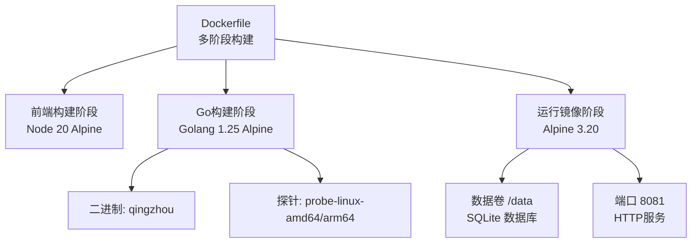
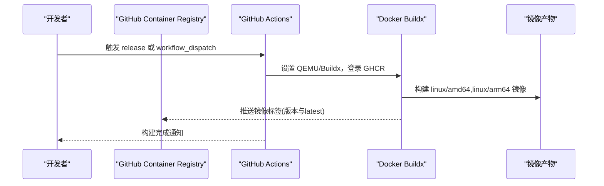
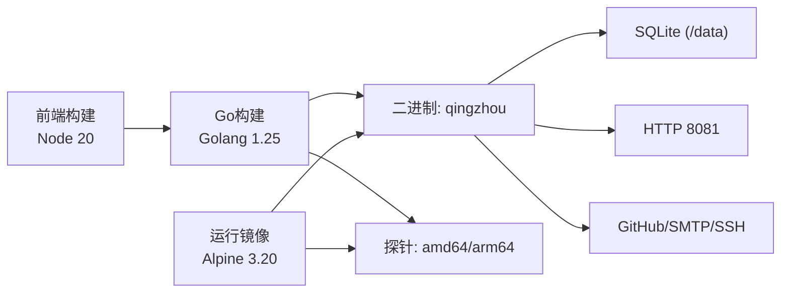

# Docker容器化部署

<cite>
**本文引用的文件**
- [Dockerfile](file://Dockerfile)
- [docker-compose.yml](file://docker-compose.yml)
- [qingzhou.env.example](file://deploy/qingzhou.env.example)
- [部署与配置手册.md](file://docs/部署与配置手册.md)
- [docker.yml](file://.github/workflows/docker.yml)
- [config.go](file://internal/config/config.go)
- [main.go](file://main.go)
- [vite.config.ts](file://frontend/vite.config.ts)
</cite>

## 目录
1. [简介](#简介)
2. [项目结构](#项目结构)
3. [核心组件](#核心组件)
4. [架构总览](#架构总览)
5. [详细组件分析](#详细组件分析)
6. [依赖关系分析](#依赖关系分析)
7. [性能考量](#性能考量)
8. [故障排查指南](#故障排查指南)
9. [结论](#结论)
10. [附录](#附录)

## 简介
本指南面向使用 Docker 与 Docker Compose 部署轻舟面板的运维与开发者。内容涵盖：
- 多阶段镜像构建流程（前端构建、Go交叉编译、运行时优化）
- 单机容器启动命令与环境变量配置
- Docker Compose 编排（数据库持久化、网络、卷挂载）
- 环境变量与配置文件映射方法
- 健康检查与资源限制
- 日志查看与常见问题定位

## 项目结构
仓库采用“前端 + Go后端”的双端一体化设计，并通过内嵌静态资源的方式将前端产物打包进单一二进制中，便于容器化与分发。关键路径：
- 前端源码与构建配置：frontend/
- Go 主程序与内部模块：internal/, main.go
- 探针源码：cmd/probe/
- 容器化相关：Dockerfile, docker-compose.yml, .github/workflows/docker.yml
- 部署示例与环境模板：deploy/

图表来源
- [Dockerfile:9-34](file://Dockerfile#L9-L34)
- [Dockerfile:36-54](file://Dockerfile#L36-L54)

章节来源
- [Dockerfile:1-55](file://Dockerfile#L1-L55)
- [docker-compose.yml:1-37](file://docker-compose.yml#L1-L37)

## 核心组件
- 前端构建阶段：基于 Node 20 Alpine，安装依赖并执行 Vite 构建，产出静态资源到 frontend/dist。
- Go构建阶段：在构建平台进行交叉编译，生成面板二进制与两种架构的探针二进制；通过 -ldflags 注入版本号。
- 运行镜像阶段：基于最小化 Alpine 3.20，仅安装必要依赖（ca-certificates、tzdata），创建非 root 用户，暴露端口与健康检查。

章节来源
- [Dockerfile:9-34](file://Dockerfile#L9-L34)
- [Dockerfile:36-54](file://Dockerfile#L36-L54)
- [vite.config.ts:27-31](file://frontend/vite.config.ts#L27-L31)

## 架构总览
容器化后的轻舟面板以单进程 HTTP 服务形式运行，默认监听 8081 端口，使用 SQLite 作为数据存储。探针二进制由面板提供下载，供被监控节点上报系统指标。CI/CD 流水线支持多架构镜像构建与发布。

图表来源
- [docker.yml:9-74](file://.github/workflows/docker.yml#L9-L74)

章节来源
- [docker.yml:9-74](file://.github/workflows/docker.yml#L9-L74)

## 详细组件分析

### 多阶段构建详解
- 前端构建阶段
  - 基础镜像：node:20-alpine
  - 工作目录：/app/frontend
  - 步骤：复制 package.json 与 lock 文件，执行 npm ci，再复制源码，最后 npx vite build 输出到 dist
  - 作用：为后续 Go 二进制内嵌静态资源做准备

- Go构建阶段
  - 基础镜像：golang:1.25-alpine
  - 交叉编译：通过 GOOS/GOARCH 分别编译面板与探针（amd64/arm64）
  - 版本注入：-ldflags 注入 internal/version.Version
  - 产物位置：/out/qingzhou 与 /out/probe

- 运行镜像阶段
  - 基础镜像：alpine:3.20
  - 依赖：ca-certificates（访问 GitHub/SMTP/SSH）、tzdata（时区）、wget（健康检查）
  - 用户与权限：创建非 root 用户 qingzhou，数据目录 /data 归属该用户
  - 环境变量：QZ_LISTEN、QZ_DB、QZ_PROBE_DIR
  - 端口：EXPOSE 8081
  - 健康检查：每30秒探测 http://127.0.0.1:8081/

章节来源
- [Dockerfile:9-34](file://Dockerfile#L9-L34)
- [Dockerfile:36-54](file://Dockerfile#L36-L54)

### 运行时配置与环境变量
- 监听地址：QZ_LISTEN（默认 0.0.0.0:8081）
- 数据库路径：QZ_DB（默认相对工作目录的 qingzhou.db）
- 管理员种子：QZ_ADMIN_USER、QZ_ADMIN_PASS（留空则首次启动随机生成并打印）
- 其他常用：QZ_PUBLIC_BASE、QZ_SECRET_KEY、QZ_PROBE_DIR、QZ_UPDATE_REPO、QZ_UPDATE_GITHUB_TOKEN、SMTP 相关变量

说明：
- 环境变量优先级：环境变量 > 设置页 > 反代头/Host
- JWT密钥由程序首次启动自动生成并存入数据库；敏感配置（如 SMTP 密码）通过 QZ_SECRET_KEY 加密落库

章节来源
- [config.go:14-28](file://internal/config/config.go#L14-L28)
- [qingzhou.env.example:1-43](file://deploy/qingzhou.env.example#L1-L43)
- [部署与配置手册.md:92-129](file://docs/部署与配置手册.md#L92-L129)

### 单机容器启动
- 使用官方预构建镜像
  - 命令示例：docker run -d --name qingzhou -p 8081:8081 -e QZ_LISTEN=0.0.0.0:8081 -e QZ_PUBLIC_BASE=https://node.example.com -e QZ_SECRET_KEY=<openssl rand -hex 32> -v qingzhou-data:/data ghcr.io/mllt992/qing-zhou:latest
- 本地构建镜像
  - 命令示例：docker build --build-arg VERSION=v0.2.7 -t qingzhou .
  - 多架构构建：docker buildx build --platform linux/amd64,linux/arm64 --build-arg VERSION=v0.2.7 -t qingzhou .

注意：
- 若使用反向代理，请确保 QZ_LISTEN 设置为回环地址（如 127.0.0.1:8081），并在代理层配置 HTTPS
- 首次启动未设置 QZ_ADMIN_PASS 会生成随机管理员密码并打印到日志

章节来源
- [docker-compose.yml:10-33](file://docker-compose.yml#L10-L33)
- [Dockerfile:45-54](file://Dockerfile#L45-L54)

### Docker Compose 多服务编排
- 服务定义
  - 服务名：qingzhou
  - 镜像：ghcr.io/mllt992/qing-zhou:latest（可切换为本地构建）
  - 端口映射：8081:8081
  - 环境变量：QZ_LISTEN、QZ_PUBLIC_BASE、QZ_SECRET_KEY、可选 QZ_ADMIN_USER/QZ_ADMIN_PASS、QZ_TRUSTED_PROXIES
  - 数据卷：命名卷 qingzhou-data 挂载至 /data，用于持久化 SQLite 数据库
- 网络与重启策略
  - restart: unless-stopped
  - 如需与其他服务通信，可在同一 compose 文件中扩展服务并配置自定义网络

章节来源
- [docker-compose.yml:10-37](file://docker-compose.yml#L10-L37)

### 健康检查与资源限制
- 健康检查
  - 内置 HEALTHCHECK：每30秒探测 http://127.0.0.1:8081/，超时5秒，重试3次
  - 可通过 docker inspect 或 docker compose ps 查看状态
- 资源限制（Compose）
  - 可在 services.qingzhou 下添加 deploy.resources.limits 与 resources.reservations（CPU、内存）
  - 示例键：cpus、memory（具体语法参考 Docker Compose 规范）

章节来源
- [Dockerfile:52-53](file://Dockerfile#L52-L53)

### 日志查看与故障排查
- 查看容器日志
  - docker logs -f qingzhou
  - docker compose logs -f qingzhou
- 常见排错
  - 无法访问面板：检查 QZ_LISTEN 是否为回环地址且已配置反向代理；检查安全组与防火墙
  - 探针安装失败：确认 QZ_PROBE_DIR 指向包含 probe-linux-amd64/arm64 的目录
  - 统计无数据：确认落地 sing-box 安装了带 with_v2ray_api 的版本；核对 QZ_SINGBOX_V2RAY 与配置一致
  - 升级后不可用：使用面板「在线更新」页的回滚功能，或指定历史版本重新安装

章节来源
- [部署与配置手册.md:237-261](file://docs/部署与配置手册.md#L237-L261)
- [qingzhou.env.example:15-25](file://deploy/qingzhou.env.example#L15-L25)

## 依赖关系分析
- 构建期依赖
  - 前端：Node 20 + Vite
  - 后端：Go 1.25 + CGO_ENABLED=0（纯 Go，modernc sqlite）
- 运行期依赖
  - 系统库：ca-certificates、tzdata
  - 工具：wget（健康检查）
- 外部集成
  - GitHub Releases（在线更新、探针下载）
  - SMTP（邮件验证/找回，可选）
  - SSH（远程管理 sing-box 节点）

图表来源
- [Dockerfile:9-54](file://Dockerfile#L9-L54)

章节来源
- [Dockerfile:9-54](file://Dockerfile#L9-L54)

## 性能考量
- 镜像体积优化
  - 多阶段构建分离前端与后端构建环境，最终运行镜像仅包含必要依赖
  - 使用 alpine 系列镜像减少体积
- 构建缓存
  - CI 中使用 GHA cache（type=gha）加速依赖下载与构建
- 运行时优化
  - 非 root 用户运行，提升安全性
  - 关闭 CGO，避免动态链接依赖，提高可移植性
  - 合理设置健康检查间隔与超时，避免频繁探测影响性能

章节来源
- [docker.yml:62-74](file://.github/workflows/docker.yml#L62-L74)
- [Dockerfile:23-24](file://Dockerfile#L23-L24)
- [Dockerfile:36-54](file://Dockerfile#L36-L54)

## 故障排查指南
- 容器无法启动
  - 检查 QZ_DB 路径是否可写（/data 卷权限）
  - 查看容器日志定位错误信息
- 面板无法访问
  - 确认 QZ_LISTEN 绑定地址与端口映射正确
  - 若使用反向代理，确保代理转发到正确的后端地址
- 探针下载失败
  - 确认 QZ_PROBE_DIR 存在且包含对应架构的二进制文件
- 证书与TLS问题
  - 检查 QZ_PUBLIC_BASE 与实际访问地址一致
  - 若使用 ACME 自动签发，确认 DNS 记录与 API Token 有效

章节来源
- [部署与配置手册.md:237-261](file://docs/部署与配置手册.md#L237-L261)
- [qingzhou.env.example:10-25](file://deploy/qingzhou.env.example#L10-L25)

## 结论
轻舟面板的容器化方案通过多阶段构建实现了前端与后端的解耦与优化，结合最小化的运行镜像与非 root 用户策略，兼顾了安全性与可维护性。Docker Compose 提供了便捷的编排能力，配合环境变量与卷挂载，可实现一键部署与数据持久化。建议在生产环境中：
- 使用反向代理与 HTTPS
- 设置 QZ_SECRET_KEY 保护敏感配置
- 定期备份 /data 中的 SQLite 数据库
- 启用健康检查与资源限制，保障服务稳定性

## 附录
- 快速开始
  - 修改 docker-compose.yml 中的环境变量（QZ_PUBLIC_BASE、QZ_SECRET_KEY）
  - 执行 docker compose up -d
  - 查看日志获取初始管理员密码（若未设置 QZ_ADMIN_PASS）
- 常用命令
  - 查看日志：docker compose logs -f qingzhou
  - 进入容器：docker exec -it qingzhou sh
  - 停止服务：docker compose down
  - 重建镜像：docker compose build

章节来源
- [docker-compose.yml:1-37](file://docker-compose.yml#L1-L37)
- [Dockerfile:45-54](file://Dockerfile#L45-L54)
