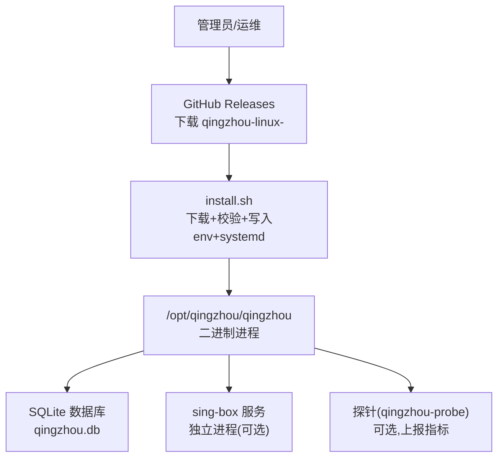
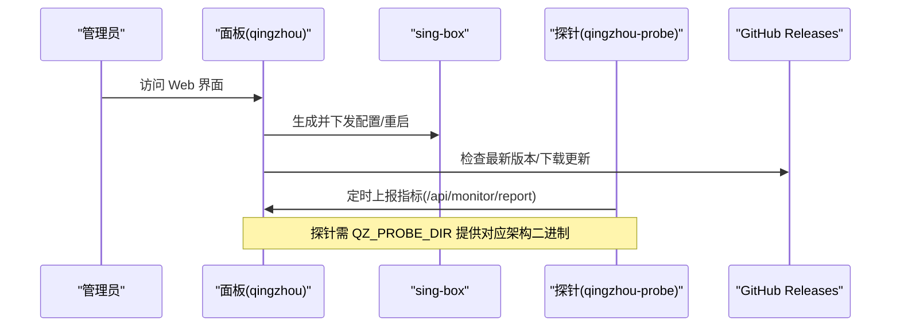
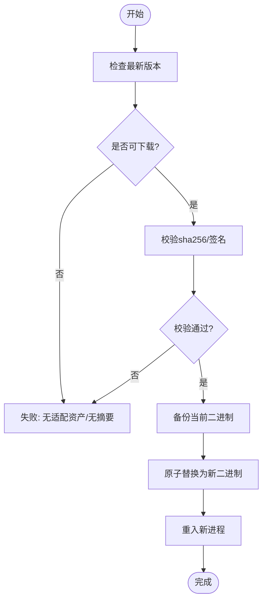
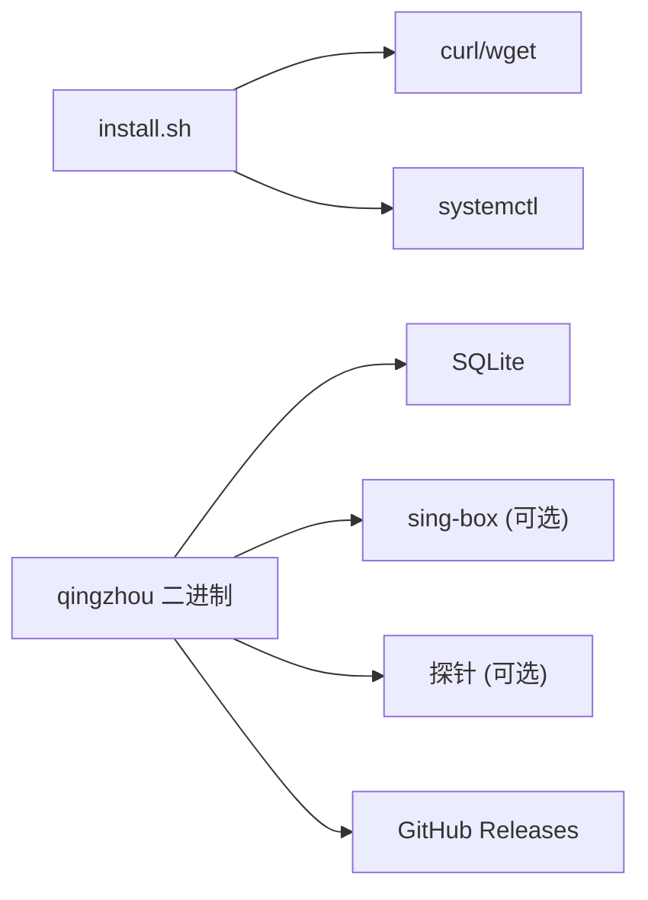

# 二进制部署

<cite>
**本文引用的文件**
- [main.go](file://cmd/probe/main.go)
- [install.sh](file://install.sh)
- [qingzhou.service](file://deploy/qingzhou.service)
- [qingzhou.env.example](file://deploy/qingzhou.env.example)
- [install-singbox.sh](file://internal/assets/install-singbox.sh)
- [updater.go](file://internal/updater/updater.go)
- [version.go](file://internal/version/version.go)
- [config.go](file://internal/config/config.go)
- [build.sh](file://cmd/probe/build.sh)
- [start.ps1](file://start.ps1)
- [部署与配置手册.md](file://docs/部署与配置手册.md)
</cite>

## 目录
1. [简介](#简介)
2. [项目结构](#项目结构)
3. [核心组件](#核心组件)
4. [架构总览](#架构总览)
5. [详细组件分析](#详细组件分析)
6. [依赖关系分析](#依赖关系分析)
7. [性能注意事项](#性能注意事项)
8. [故障排查指南](#故障排查指南)
9. [结论](#结论)
10. [附录](#附录)

## 简介
本指南面向“轻舟面板”的二进制部署，覆盖从 GitHub Releases 下载预编译二进制、Linux 安装与服务注册、Windows 平台启动脚本使用、Systemd 服务与环境变量、开机自启与服务管理命令、以及版本管理与更新方法。文档基于仓库内提供的安装脚本、服务单元、环境变量示例与内置在线更新能力整理而成，确保可操作且可追溯。

## 项目结构
- 二进制主程序：由 Go 构建的单文件程序，内置前端资源与 SQLite 数据库，默认监听端口可通过环境变量调整。
- 探针（可选）：轻量监控代理，按固定间隔上报 CPU/内存/磁盘/网络等指标到面板。
- 一键安装脚本：自动识别架构、下载 release、校验 SHA-256、生成 systemd 服务并启动。
- Systemd 服务单元与环境变量模板：用于生产环境的服务化运行。
- Windows 启动脚本：便于在 Windows 环境下以开发模式快速启动后端。

图表来源
- [install.sh:195-351](file://install.sh#L195-L351)
- [qingzhou.service:1-22](file://deploy/qingzhou.service#L1-L22)
- [qingzhou.env.example:1-43](file://deploy/qingzhou.env.example#L1-L43)

章节来源
- [install.sh:1-407](file://install.sh#L1-L407)
- [deploy/qingzhou.service:1-22](file://deploy/qingzhou.service#L1-L22)
- [deploy/qingzhou.env.example:1-43](file://deploy/qingzhou.env.example#L1-L43)

## 核心组件
- 面板二进制（qingzhou）：单文件 Go 程序，内置前端与 SQLite，负责用户/套餐/订阅/统计/可视化管理。
- 探针（qingzhou-probe）：仅 Linux，采集系统指标并通过 HTTP POST 上报至面板。
- 安装脚本（install.sh）：自动化安装/升级/卸载，支持指定版本、加速代理、SHA-256 校验。
- Systemd 服务单元与环境变量：定义工作目录、环境变量文件、重启策略与安全加固。
- 在线更新器（updater）：通过 GitHub Releases 检查并执行原子替换与重入，支持回滚。

章节来源
- [internal/config/config.go:1-36](file://internal/config/config.go#L1-L36)
- [cmd/probe/main.go:1-119](file://cmd/probe/main.go#L1-L119)
- [internal/updater/updater.go:1-702](file://internal/updater/updater.go#L1-L702)
- [internal/version/version.go:1-79](file://internal/version/version.go#L1-L79)

## 架构总览
轻舟面板作为控制面，负责配置下发与状态收集；数据面由 sing-box 承载流量。探针为可选的监控节点，定期上报系统指标。所有组件均可通过 systemd 进行生命周期管理。

图表来源
- [internal/updater/updater.go:314-346](file://internal/updater/updater.go#L314-L346)
- [cmd/probe/main.go:75-91](file://cmd/probe/main.go#L75-L91)
- [internal/assets/install-singbox.sh:147-168](file://internal/assets/install-singbox.sh#L147-L168)

## 详细组件分析

### Linux 二进制部署（推荐方式）
- 前置条件
  - 操作系统：Linux（x86_64/amd64 或 aarch64/arm64）。
  - 权限：需要 root 权限以安装 systemd 服务与写入 /opt/qingzhou。
  - 工具：curl 或 wget、systemd。

- 安装步骤
  1) 执行一键安装脚本，自动识别架构、下载最新 release、校验 SHA-256、生成 systemd 服务并启动。
     - 支持参数：--version vX.Y.Z、--force、--proxy https://mirror.ghproxy.com/。
     - 非交互模式可通过环境变量覆盖：QZ_LISTEN、QZ_PUBLIC_BASE、QZ_ADMIN_USER、QZ_ADMIN_PASS。
  2) 首次访问后设置管理员密码（若未设置则随机生成并记录日志）。
  3) 如需反代，将 QZ_LISTEN 改为 127.0.0.1:8081，并在 nginx/caddy 中反向代理到该地址。
  4) 可选：启用探针监控，需在 env 中设置 QZ_PROBE_DIR 指向包含 probe-linux-amd64/arm64 的目录。

- 目录结构与权限
  - 工作目录：/opt/qingzhou
  - 二进制：/opt/qingzhou/qingzhou（chmod +x）
  - 环境变量文件：/opt/qingzhou/qingzhou.env（chmod 600，不提交真实值）
  - 数据库：/opt/qingzhou/qingzhou.db（SQLite）
  - 探针目录（可选）：/opt/qingzhou/probe（存放 probe-linux-* 二进制）

- Systemd 服务配置要点
  - 服务名：qingzhou
  - 工作目录：/opt/qingzhou
  - 环境变量文件：/opt/qingzhou/qingzhou.env
  - 启动命令：/opt/qingzhou/qingzhou
  - 重启策略：on-failure，RestartSec=5s
  - 安全加固：NoNewPrivileges=true，ProtectSystem=full

- 开机自启动与服务管理命令
  - 启用开机自启：systemctl enable qingzhou
  - 启动/停止/重启：systemctl start|stop|restart qingzhou
  - 查看状态：systemctl status qingzhou
  - 查看日志：journalctl -u qingzhou -f

- 常用环境变量（部分）
  - QZ_LISTEN：监听地址，默认 0.0.0.0:8081
  - QZ_DB：数据库路径，默认相对工作目录
  - QZ_PUBLIC_BASE：面板对外访问地址（优先级高于设置页）
  - QZ_PROBE_DIR：探针二进制目录（二进制部署时通常需设为绝对路径）
  - QZ_SECRET_KEY：敏感配置加密主密钥（建议环境变量，不入库）
  - SMTP 相关：QZ_SMTP_HOST/PORT/USER/PASS/FROM/SECURITY（可选）

章节来源
- [install.sh:85-113](file://install.sh#L85-L113)
- [install.sh:195-351](file://install.sh#L195-L351)
- [install.sh:353-407](file://install.sh#L353-L407)
- [deploy/qingzhou.service:1-22](file://deploy/qingzhou.service#L1-L22)
- [deploy/qingzhou.env.example:1-43](file://deploy/qingzhou.env.example#L1-L43)
- [internal/config/config.go:14-29](file://internal/config/config.go#L14-L29)

### Windows 平台部署与 PowerShell 脚本
- 说明
  - 仓库提供 start.ps1 用于 Windows 下开发模式快速启动后端。
  - 生产环境建议使用 Docker 或源码构建；二进制发布主要面向 Linux。
- 使用方法
  - 打开 PowerShell，进入项目根目录，执行 start.ps1。
  - 脚本会设置 QZ_LISTEN=127.0.0.1:8081，并可选择直读 frontend/dist 进行热更新。
  - 生产留空 QZ_WEB_DIR，使用编译进二进制的内嵌资源。
- 注意事项
  - 生产环境建议通过反向代理暴露 HTTPS，并妥善管理证书。
  - 如需持久化数据库，请确保工作目录下 qingzhou.db 所在路径具备写权限。

章节来源
- [start.ps1:1-18](file://start.ps1#L1-L18)

### 探针监控（可选）
- 功能
  - 采集 CPU/内存/磁盘/网络/负载/进程指标，定时 POST 到面板 /api/monitor/report。
  - 支持命令行参数与环境变量两种方式注入 server/token。
- 安装与配置
  - 二进制部署时，需在 env 中设置 QZ_PROBE_DIR 指向包含 probe-linux-amd64/arm64 的目录。
  - 探针二进制可从 GitHub Release 下载，文件名保持不变。
  - 探针服务由 install.sh 在安装阶段可选托管，或手动安装。
- 安全提示
  - 避免将 token 直接写在命令行，优先使用 EnvironmentFile（mode 600）。
  - 不建议在生产开启 -insecure 跳过 TLS 校验。

章节来源
- [cmd/probe/main.go:27-73](file://cmd/probe/main.go#L27-L73)
- [cmd/probe/main.go:75-91](file://cmd/probe/main.go#L75-L91)
- [cmd/probe/build.sh:1-16](file://cmd/probe/build.sh#L1-L16)
- [deploy/qingzhou.env.example:15-20](file://deploy/qingzhou.env.example#L15-L20)

### Systemd 服务与环境变量详解
- 服务单元关键项
  - Type=simple，WorkingDirectory=/opt/qingzhou
  - EnvironmentFile=/opt/qingzhou/qingzhou.env
  - ExecStart=/opt/qingzhou/qingzhou
  - Restart=on-failure，RestartSec=5s
  - NoNewPrivileges=true，ProtectSystem=full
- 环境变量优先级
  - QZ_PUBLIC_BASE：环境变量 > 设置页 > 反代头/Host
- 安全加固
  - 限制最小权限，只允许写入 /opt/qingzhou 与 /etc/sing-box（如适用）

章节来源
- [deploy/qingzhou.service:1-22](file://deploy/qingzhou.service#L1-L22)
- [deploy/qingzhou.env.example:1-43](file://deploy/qingzhou.env.example#L1-L43)

### 版本管理与更新
- 在线更新（Linux）
  - 面板内置 updater 模块，查询 GitHub Releases 最新版本，下载并校验 sha256，原子替换当前二进制并重入。
  - 支持选择特定版本安装（包括旧版本），失败时可回滚到上一个版本。
  - 仅 Linux 支持自更新；其他平台需手动替换二进制。
- 版本号来源
  - 构建时通过 ldflags 注入版本；开发构建视为 dev，总是提示可用最新。
- 更新流程概览
  - 检查版本 → 下载资产 → 校验摘要/签名 → 备份旧版 → 原子替换 → 重启服务

图表来源
- [internal/updater/updater.go:314-346](file://internal/updater/updater.go#L314-L346)
- [internal/updater/updater.go:422-576](file://internal/updater/updater.go#L422-L576)
- [internal/version/version.go:18-26](file://internal/version/version.go#L18-L26)

章节来源
- [internal/updater/updater.go:1-702](file://internal/updater/updater.go#L1-L702)
- [internal/version/version.go:1-79](file://internal/version/version.go#L1-L79)

## 依赖关系分析
- 安装脚本依赖
  - curl/wget：下载二进制与校验文件
  - systemctl：管理服务生命周期
  - OpenSSL/random：生成随机十六进制密钥
- 运行时依赖
  - SQLite：本地数据库
  - sing-box：独立进程，负责流量承载（可选）
  - 探针：可选，上报系统指标
- 外部依赖
  - GitHub Releases：获取二进制与校验信息
  - 邮件服务（SMTP）：可选，用于验证/重置链接

图表来源
- [install.sh:85-113](file://install.sh#L85-L113)
- [internal/updater/updater.go:150-162](file://internal/updater/updater.go#L150-L162)

章节来源
- [install.sh:85-113](file://install.sh#L85-L113)
- [internal/updater/updater.go:150-162](file://internal/updater/updater.go#L150-L162)

## 性能注意事项
- 监听地址
  - 默认 0.0.0.0:8081；若使用反代，建议设置为 127.0.0.1:8081 以减少暴露面。
- 数据库路径
  - 将 qingzhou.db 放在可靠存储上，避免频繁 I/O 瓶颈。
- 探针采样间隔
  - 默认 30 秒，可根据服务器负载调整，最低不低于 5 秒。
- sing-box 资源限制
  - 通过 systemd 的 LimitNOFILE 等参数提升文件句柄上限，保障高并发场景。

章节来源
- [internal/config/config.go:14-29](file://internal/config/config.go#L14-L29)
- [cmd/probe/main.go:52-55](file://cmd/probe/main.go#L52-L55)
- [internal/assets/install-singbox.sh:147-168](file://internal/assets/install-singbox.sh#L147-L168)

## 故障排查指南
- 面板装完打不开
  - 检查 QZ_LISTEN 是否为回环地址且未配置反代；必要时改为 0.0.0.0:8081 并放行端口。
- 服务未启动成功
  - 查看日志：journalctl -u qingzhou -n 30 --no-pager
- 探针安装失败（HTTP 404）
  - 确认 QZ_PROBE_DIR 已设置且包含对应架构的 probe-linux-* 二进制。
- 在线更新失败
  - 检查网络与 GitHub API 速率限制；可配置 QZ_UPDATE_GITHUB_TOKEN 提升限额。
- sing-box 启动失败
  - 查看 journalctl -u sing-box -n 50，或使用 sing-box check 校验配置。

章节来源
- [install.sh:353-407](file://install.sh#L353-L407)
- [deploy/qingzhou.env.example:15-20](file://deploy/qingzhou.env.example#L15-L20)
- [internal/updater/updater.go:164-178](file://internal/updater/updater.go#L164-L178)

## 结论
通过一键安装脚本与 Systemd 服务单元，轻舟面板可在 Linux 上快速、安全地部署与运行；探针提供可选的系统监控能力；内置在线更新机制简化了版本管理与回滚。Windows 平台可使用 PowerShell 脚本进行开发模式启动。生产环境建议配合反代与 HTTPS，并合理配置环境变量与安全加固选项。

## 附录
- 参考手册
  - 部署与配置手册提供了更详细的安装顺序、协议选型与运维排错指引。

章节来源
- [docs/部署与配置手册.md:1-261](file://docs/部署与配置手册.md#L1-L261)
