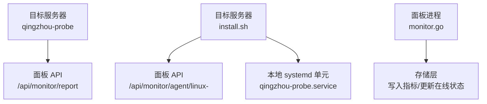
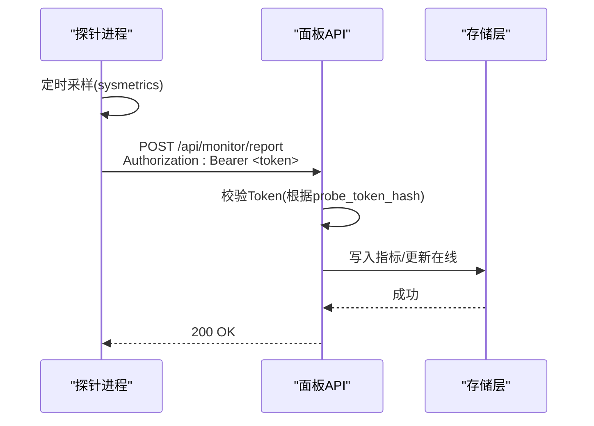
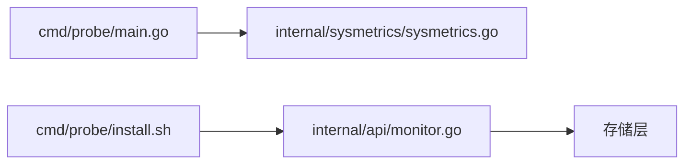

# 探针程序部署

<cite>
**本文引用的文件**
- [cmd/probe/main.go](file://cmd/probe/main.go)
- [cmd/probe/build.sh](file://cmd/probe/build.sh)
- [cmd/probe/install.sh](file://cmd/probe/install.sh)
- [internal/api/monitor.go](file://internal/api/monitor.go)
- [internal/sysmetrics/sysmetrics.go](file://internal/sysmetrics/sysmetrics.go)
- [deploy/qingzhou.service](file://deploy/qingzhou.service)
- [deploy/qingzhou.env.example](file://deploy/qingzhou.env.example)
- [docs/部署与配置手册.md](file://docs/部署与配置手册.md)
</cite>

## 目录
1. [简介](#简介)
2. [项目结构](#项目结构)
3. [核心组件](#核心组件)
4. [架构总览](#架构总览)
5. [详细组件分析](#详细组件分析)
6. [依赖关系分析](#依赖关系分析)
7. [性能考虑](#性能考虑)
8. [故障排查指南](#故障排查指南)
9. [结论](#结论)
10. [附录](#附录)

## 简介
本指南面向需要在多台目标服务器上独立部署“轻舟”监控探针的程序。内容涵盖：
- 探针的构建与跨平台编译（Linux amd64/arm64）
- 安装脚本使用方法与自动分发机制
- 探针与主面板的通信协议与认证方式
- Linux Systemd 服务化部署步骤
- Windows 下的运行方式说明
- 探针配置选项与性能调优参数
- 健康检查与状态监控方法
- 日志收集与问题诊断技巧

## 项目结构
探针相关代码位于 cmd/probe，包含可执行程序入口、构建脚本与一键安装脚本；面板侧提供探针二进制下载、安装脚本下发以及指标接收接口。系统指标采集由 internal/sysmetrics 实现，并通过 HTTP POST 上报到面板 /api/monitor/report。

图表来源
- [cmd/probe/main.go:34-91](file://cmd/probe/main.go#L34-L91)
- [cmd/probe/install.sh:20-101](file://cmd/probe/install.sh#L20-L101)
- [internal/api/monitor.go:20-73](file://internal/api/monitor.go#L20-L73)

章节来源
- [cmd/probe/main.go:1-119](file://cmd/probe/main.go#L1-L119)
- [cmd/probe/build.sh:1-16](file://cmd/probe/build.sh#L1-L16)
- [cmd/probe/install.sh:1-116](file://cmd/probe/install.sh#L1-L116)
- [internal/api/monitor.go:1-180](file://internal/api/monitor.go#L1-L180)

## 核心组件
- 探针主程序：定时采集系统指标并通过 HTTP POST 上报，支持通过命令行或环境变量注入面板地址与令牌。
- 指标采集器：从 /proc 读取 CPU、内存、磁盘、网络、负载、进程数等指标，并计算速率与百分比。
- 面板端探针接口：提供探针二进制下载、安装脚本下发、指标接收与鉴权、仪表盘数据聚合。
- 安装脚本：自动下载对应架构的二进制、创建安全的环境配置文件、生成并启动 systemd 服务。

章节来源
- [cmd/probe/main.go:27-91](file://cmd/probe/main.go#L27-L91)
- [internal/sysmetrics/sysmetrics.go:16-38](file://internal/sysmetrics/sysmetrics.go#L16-L38)
- [internal/api/monitor.go:20-73](file://internal/api/monitor.go#L20-L73)
- [cmd/probe/install.sh:20-101](file://cmd/probe/install.sh#L20-L101)

## 架构总览
探针在目标服务器上以守护进程形式运行，周期性采集系统指标并以 JSON 格式 POST 到面板的 /api/monitor/report，请求头携带 Bearer Token 进行鉴权。面板校验 Token 后写入指标并更新服务器在线状态。

图表来源
- [cmd/probe/main.go:94-118](file://cmd/probe/main.go#L94-L118)
- [internal/api/monitor.go:20-55](file://internal/api/monitor.go#L20-L55)

## 详细组件分析

### 探针主程序（Linux）
- 启动参数与环境变量：
  - server：面板地址（必填），也可通过 QZ_PROBE_SERVER 设置
  - token：鉴权令牌（必填），也可通过 QZ_PROBE_TOKEN 设置
  - interval：采集间隔秒数（默认30，最小5）
  - insecure：跳过TLS证书校验（仅测试用）
- 行为要点：
  - 首次采样丢弃（用于预热CPU和网络速率计算）
  - 使用 http.Client 超时控制
  - 报告 URL 固定为 server + "/api/monitor/report"
  - 请求头包含 Content-Type: application/json 与 Authorization: Bearer <token>

章节来源
- [cmd/probe/main.go:27-91](file://cmd/probe/main.go#L27-L91)
- [cmd/probe/main.go:94-118](file://cmd/probe/main.go#L94-L118)

### 指标采集器（sysmetrics）
- 采集字段包括：CPU使用率、内存使用/总量、Swap使用/总量、磁盘使用/总量、网络收发字节、1/5/15分钟负载、TCP连接数、进程数、运行时长、主机名、平台、内核、架构等。
- 算法要点：
  - CPU使用率基于两次采样的忙闲时间差计算
  - 网络速度基于两次采样间隔的字节差除以时间
  - 过滤伪文件系统类型，避免统计虚文件系统
  - 仅统计物理网卡前缀（如 eth、ens、enp、wlan、em、eno）

章节来源
- [internal/sysmetrics/sysmetrics.go:16-38](file://internal/sysmetrics/sysmetrics.go#L16-L38)
- [internal/sysmetrics/sysmetrics.go:54-83](file://internal/sysmetrics/sysmetrics.go#L54-L83)
- [internal/sysmetrics/sysmetrics.go:85-109](file://internal/sysmetrics/sysmetrics.go#L85-L109)

### 面板端探针接口
- 指标接收：
  - 路径：POST /api/monitor/report
  - 鉴权：Authorization: Bearer <token>，后端根据 probe_token_hash 查找服务器
  - 成功后写入指标并更新服务器状态为 online
- 探针二进制下载：
  - 路径：GET /api/monitor/agent/{arch}，arch 支持 linux-amd64 与 linux-arm64
  - 文件来源：QZ_PROBE_DIR 环境变量指定目录，默认相对路径 cmd/probe/dist
- 一键安装脚本：
  - 路径：GET /api/monitor/install.sh
  - 脚本会下载对应架构二进制、创建环境文件、生成 systemd 单元并启动服务

章节来源
- [internal/api/monitor.go:20-73](file://internal/api/monitor.go#L20-L73)
- [internal/api/monitor.go:75-179](file://internal/api/monitor.go#L75-L179)

### 安装脚本与自动分发
- 自动分发流程：
  - 检测目标架构（x86_64 → amd64，aarch64 → arm64）
  - 从面板 /api/monitor/agent/linux-<arch> 下载二进制
  - 原子替换安装路径（避免 ETXTBSY 错误）
  - 创建 /etc/qingzhou-probe.env（权限600），写入 QZ_PROBE_SERVER 与 QZ_PROBE_TOKEN
  - 生成 qingzhou-probe.service 并启用、重启服务
- 卸载命令：
  - systemctl disable --now qingzhou-probe && rm 相关文件

章节来源
- [cmd/probe/install.sh:20-116](file://cmd/probe/install.sh#L20-L116)

### 构建与跨平台编译
- 构建脚本 build.sh 会在 dist 目录下产出：
  - probe-linux-amd64
  - probe-linux-arm64
- 编译参数：
  - GOOS=linux，GOARCH=amd64/arm64
  - -ldflags="-s -w" 去除调试信息减小体积

章节来源
- [cmd/probe/build.sh:1-16](file://cmd/probe/build.sh#L1-L16)

### Linux Systemd 服务配置
- 服务单元关键项：
  - Type=simple，EnvironmentFile=/etc/qingzhou-probe.env
  - ExecStart=/usr/local/bin/qingzhou-probe
  - Restart=always，RestartSec=10
  - 安全加固：NoNewPrivileges=true，ProtectSystem=strict，ProtectHome=true，ReadOnlyPaths=/proc /sys
- 管理命令：
  - systemctl daemon-reload
  - systemctl enable --now qingzhou-probe
  - journalctl -u qingzhou-probe -f

章节来源
- [cmd/probe/install.sh:76-101](file://cmd/probe/install.sh#L76-L101)

### Windows 部署说明
- 当前探针源码带有 Linux 构建标签，未提供 Windows 原生二进制与服务封装。
- 可在 Windows 上通过 WSL 或容器运行 Linux 版探针，或使用 Linux 虚拟机承载探针。
- 若需 Windows 原生支持，建议将探针逻辑移植至 Go 并使用 Windows 服务管理器注册服务。

[本节为概念性说明，不直接分析具体文件]

### 配置选项与性能调优
- 探针侧：
  - interval：采集间隔，建议不低于5秒；过高频率会增加面板写入压力
  - insecure：仅测试环境使用，生产务必启用 TLS 校验
- 面板侧：
  - QZ_PROBE_DIR：探针二进制存放目录，确保安装脚本能下载到正确架构二进制
  - QZ_PUBLIC_BASE：面板对外访问地址，影响安装脚本生成的面板 URL
  - 告警阈值：在「系统设置 → 监控告警阈值」调整 CPU/内存/磁盘阈值

章节来源
- [cmd/probe/main.go:27-32](file://cmd/probe/main.go#L27-L32)
- [deploy/qingzhou.env.example:15-20](file://deploy/qingzhou.env.example#L15-L20)
- [docs/部署与配置手册.md:210-221](file://docs/部署与配置手册.md#L210-L221)

### 健康检查与状态监控
- 探针健康：
  - 查看服务状态：systemctl is-active qingzhou-probe
  - 查看最近日志：journalctl -u qingzhou-probe -n 20 --no-pager
- 面板侧监控：
  - 监控仪表盘展示在线/离线数量、汇总资源使用情况
  - 热力图按时间桶展示各服务器负载等级
  - 公开页面可查看已启用的服务器迷你趋势图

章节来源
- [internal/api/monitor.go:183-241](file://internal/api/monitor.go#L183-L241)
- [internal/api/monitor.go:375-428](file://internal/api/monitor.go#L375-L428)

### 日志收集与问题诊断
- 常见错误：
  - 下载失败：检查网络连接、DNS解析、HTTP状态码
  - 服务启动失败：查看 systemd 日志定位原因
  - 401/403：确认 QZ_PROBE_TOKEN 是否正确且已启用探针
- 诊断步骤：
  - 验证探针二进制是否可执行
  - 检查 /etc/qingzhou-probe.env 权限是否为600
  - 确认面板 /api/monitor/agent/linux-<arch> 可访问
  - 使用 curl 模拟请求测试鉴权与响应

章节来源
- [cmd/probe/install.sh:32-66](file://cmd/probe/install.sh#L32-L66)
- [cmd/probe/install.sh:103-115](file://cmd/probe/install.sh#L103-L115)
- [internal/api/monitor.go:20-55](file://internal/api/monitor.go#L20-L55)

## 依赖关系分析
- 探针依赖 sysmetrics 包采集系统指标
- 面板 monitor.go 提供探针相关 API 并依赖存储层持久化指标
- 安装脚本依赖 curl/wget、systemd 与 bash 环境

图表来源
- [cmd/probe/main.go:24-25](file://cmd/probe/main.go#L24-L25)
- [internal/api/monitor.go:14-16](file://internal/api/monitor.go#L14-L16)
- [cmd/probe/install.sh:20-101](file://cmd/probe/install.sh#L20-L101)

章节来源
- [cmd/probe/main.go:12-25](file://cmd/probe/main.go#L12-L25)
- [internal/api/monitor.go:1-16](file://internal/api/monitor.go#L1-L16)
- [cmd/probe/install.sh:1-16](file://cmd/probe/install.sh#L1-L16)

## 性能考虑
- 采集间隔：interval 不宜过小，避免对面板写入造成压力
- 网络传输：JSON 体较小，但高频上报仍需谨慎
- 面板写入：批量写入与索引优化可提升吞吐
- 存储保留：合理设置指标保留策略，避免数据库膨胀

[本节为通用指导，不直接分析具体文件]

## 故障排查指南
- 安装阶段：
  - 确认架构识别正确（x86_64/aarch64）
  - 检查面板代理/防火墙是否放行端口
  - 验证 QZ_PROBE_DIR 下存在对应架构二进制
- 运行阶段：
  - 使用 journalctl 查看探针日志
  - 检查 /etc/qingzhou-probe.env 内容与权限
  - 在面板监控页确认服务器状态与指标更新
- 常见问题：
  - 404 下载失败：检查 QZ_PROBE_DIR 与面板访问地址
  - 401/403 鉴权失败：确认 Token 有效且已启用探针
  - 服务频繁重启：检查系统资源与日志错误堆栈

章节来源
- [cmd/probe/install.sh:32-66](file://cmd/probe/install.sh#L32-L66)
- [cmd/probe/install.sh:103-115](file://cmd/probe/install.sh#L103-L115)
- [internal/api/monitor.go:20-55](file://internal/api/monitor.go#L20-L55)

## 结论
轻舟探针提供了轻量、安全的服务器监控方案。通过标准化构建与一键安装脚本，可在 Linux 环境下快速部署并集成到面板监控体系。生产环境建议使用环境变量注入敏感信息、启用 TLS 校验并合理设置采集间隔。Windows 原生支持需额外开发，当前可通过 WSL 或容器间接运行。

[本节为总结性内容，不直接分析具体文件]

## 附录
- 参考文档：部署与配置手册中关于探针监控的安装与配置说明
- 服务模板：deploy/qingzhou.service 可作为面板服务的参考模板

章节来源
- [docs/部署与配置手册.md:210-221](file://docs/部署与配置手册.md#L210-L221)
- [deploy/qingzhou.service:1-22](file://deploy/qingzhou.service#L1-L22)
