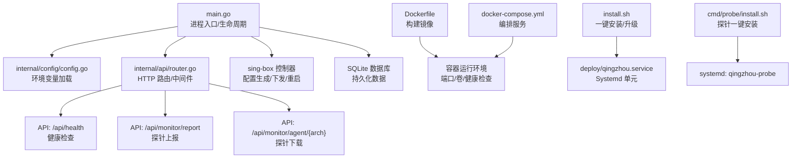
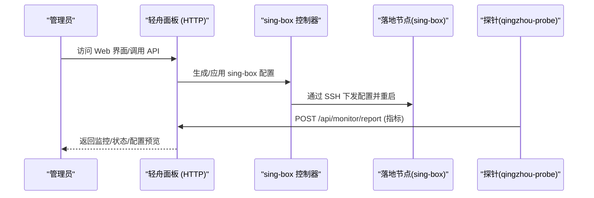
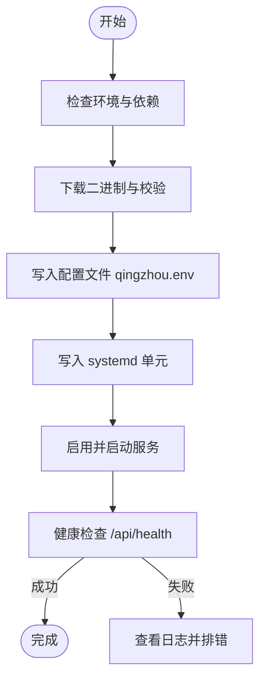
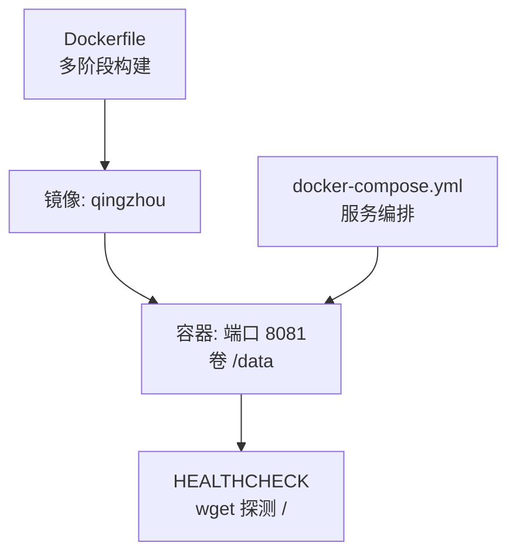
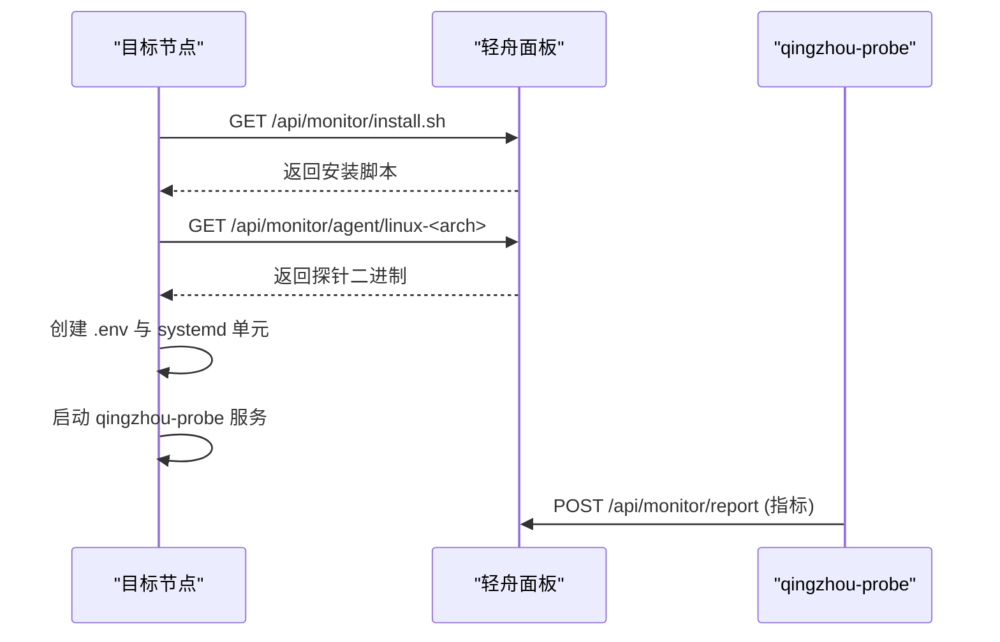
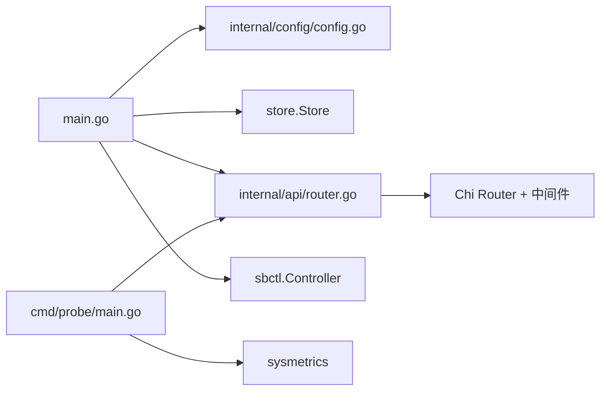

# 部署指南

<cite>
**本文引用的文件**
- [main.go](file://main.go)
- [Dockerfile](file://Dockerfile)
- [docker-compose.yml](file://docker-compose.yml)
- [install.sh](file://install.sh)
- [deploy/qingzhou.service](file://deploy/qingzhou.service)
- [deploy/backup.sh](file://deploy/backup.sh)
- [cmd/probe/main.go](file://cmd/probe/main.go)
- [cmd/probe/install.sh](file://cmd/probe/install.sh)
- [internal/config/config.go](file://internal/config/config.go)
- [internal/api/router.go](file://internal/api/router.go)
- [docs/部署与配置手册.md](file://docs/部署与配置手册.md)
- [start.ps1](file://start.ps1)
</cite>

## 目录
1. [简介](#简介)
2. [项目结构](#项目结构)
3. [核心组件](#核心组件)
4. [架构总览](#架构总览)
5. [详细组件分析](#详细组件分析)
6. [依赖关系分析](#依赖关系分析)
7. [性能考虑](#性能考虑)
8. [故障排查指南](#故障排查指南)
9. [结论](#结论)
10. [附录](#附录)

## 简介
本指南面向运维与管理员，提供轻舟面板的完整部署方案，覆盖：
- 单机二进制部署（Linux）
- Docker 容器化部署
- Docker Compose 多服务部署
- 探针程序的独立部署与自动分发机制
- 服务注册与开机自启动（Systemd）
- 不同平台的部署脚本与使用方法（Linux、Windows 开发模式）
- 部署验证与健康检查
- 故障排查与回滚策略

轻舟面板为单文件 Go 程序（内置前端与 SQLite），负责用户、套餐、订阅、统计与可视化管理；流量承载由 sing-box 完成。面板可本地运行 sing-box，也可通过 SSH 远程管理多台落地节点。

## 项目结构
仓库包含后端主程序、探针、Docker 构建与编排、一键安装脚本、Systemd 单元、备份脚本以及文档等。关键路径与职责如下：
- 后端入口与生命周期管理：main.go
- 配置加载与环境变量：internal/config/config.go
- HTTP 路由与 API：internal/api/router.go
- 探针程序与安装脚本：cmd/probe/*
- 容器镜像与编排：Dockerfile、docker-compose.yml
- 一键安装与 Systemd 服务模板：install.sh、deploy/qingzhou.service
- 备份脚本：deploy/backup.sh
- Windows 开发启动脚本：start.ps1
- 官方部署手册：docs/部署与配置手册.md

**图表来源**
- [main.go:25-142](file://main.go#L25-L142)
- [internal/config/config.go:14-29](file://internal/config/config.go#L14-L29)
- [internal/api/router.go:132-387](file://internal/api/router.go#L132-L387)
- [Dockerfile:1-55](file://Dockerfile#L1-L55)
- [docker-compose.yml:1-37](file://docker-compose.yml#L1-L37)
- [install.sh:1-407](file://install.sh#L1-L407)
- [deploy/qingzhou.service:1-22](file://deploy/qingzhou.service#L1-L22)
- [cmd/probe/install.sh:1-116](file://cmd/probe/install.sh#L1-L116)

**章节来源**
- [main.go:25-142](file://main.go#L25-L142)
- [internal/config/config.go:14-29](file://internal/config/config.go#L14-L29)
- [internal/api/router.go:132-387](file://internal/api/router.go#L132-L387)
- [Dockerfile:1-55](file://Dockerfile#L1-L55)
- [docker-compose.yml:1-37](file://docker-compose.yml#L1-L37)
- [install.sh:1-407](file://install.sh#L1-L407)
- [deploy/qingzhou.service:1-22](file://deploy/qingzhou.service#L1-L22)
- [cmd/probe/install.sh:1-116](file://cmd/probe/install.sh#L1-L116)

## 核心组件
- 面板主进程：加载配置、打开并迁移数据库、初始化邮件器、启动 sing-box 控制器、后台任务（源同步、维护、监控、证书续期、队列推进）、HTTP 服务器监听与优雅关闭。
- 探针程序：采集 CPU/内存/磁盘/网络/负载/进程数等指标，定时 POST 到面板 /api/monitor/report。
- 容器镜像：多阶段构建，嵌入前端资源，交叉编译 Go 二进制与探针，最小化运行镜像，暴露端口与健康检查。
- 编排与服务：docker-compose 定义服务、端口映射、环境变量与数据卷；Systemd 单元实现开机自启与崩溃重启。
- 安装脚本：检测版本、下载校验、写入 env、创建 systemd、启动服务、健康检查确认。

**章节来源**
- [main.go:25-142](file://main.go#L25-L142)
- [cmd/probe/main.go:1-119](file://cmd/probe/main.go#L1-L119)
- [Dockerfile:1-55](file://Dockerfile#L1-L55)
- [docker-compose.yml:1-37](file://docker-compose.yml#L1-L37)
- [install.sh:1-407](file://install.sh#L1-L407)
- [deploy/qingzhou.service:1-22](file://deploy/qingzhou.service#L1-L22)

## 架构总览
轻舟面板作为“中心机”，通过 HTTP API 对外提供服务，并通过内置 sing-box 控制器管理本机或远程节点的 sing-box 进程。探针在每台服务器上采集系统指标并上报至面板。

**图表来源**
- [internal/api/router.go:132-387](file://internal/api/router.go#L132-L387)
- [main.go:85-106](file://main.go#L85-L106)
- [cmd/probe/main.go:75-91](file://cmd/probe/main.go#L75-L91)

## 详细组件分析

### 单机二进制部署（Linux）
- 前置条件
  - Linux 系统、systemd、curl 或 wget、root 权限。
  - 可选：Nginx/Caddy 反代与 HTTPS。
- 一键安装
  - 以 root 执行安装脚本，自动识别架构、下载最新 release、校验 SHA-256、引导配置、写入 systemd 并启动。
  - 支持参数：指定版本、强制重装、代理加速、卸载。
- 手动部署
  - 将二进制放置到 /opt/qingzhou/qingzhou，设置 /opt/qingzhou/qingzhou.env（chmod 600）。
  - 复制 deploy/qingzhou.service 到 /etc/systemd/system，启用并启动服务。
  - 如需反代，确保 QZ_LISTEN 设置为 127.0.0.1:8081，并在反代层开启 HTTPS。
- 环境变量要点
  - QZ_LISTEN：监听地址，默认 0.0.0.0:8081；有反代时建议 127.0.0.1:8081。
  - QZ_DB：SQLite 数据库路径。
  - QZ_PUBLIC_BASE：面板对外访问地址（影响订阅链接、探针安装命令、邮件链接等）。
  - QZ_SECRET_KEY：敏感配置加密主密钥，务必设置且不要更换。
  - QZ_PROBE_DIR：探针二进制目录，供面板提供下载。
- 健康检查与验证
  - 安装完成后脚本会轮询 /api/health 确认服务就绪。
  - 可通过 systemctl status qingzhou 与 journalctl 查看日志。

**图表来源**
- [install.sh:85-149](file://install.sh#L85-L149)
- [install.sh:151-215](file://install.sh#L151-L215)
- [install.sh:217-351](file://install.sh#L217-L351)
- [install.sh:353-407](file://install.sh#L353-L407)

**章节来源**
- [install.sh:1-407](file://install.sh#L1-L407)
- [deploy/qingzhou.service:1-22](file://deploy/qingzhou.service#L1-L22)
- [internal/config/config.go:14-29](file://internal/config/config.go#L14-L29)

### Docker 容器化部署
- 镜像构建
  - 多阶段构建：先构建前端资源，再交叉编译 Go 二进制与探针，最后使用 alpine 运行镜像。
  - 暴露端口 8081，挂载 /data 持久化数据库，设置 HEALTHCHECK 健康检查。
- 运行方式
  - 直接 docker run 或使用 docker-compose。
  - 必须设置 QZ_LISTEN=0.0.0.0:8081 以便端口映射生效。
  - 推荐设置 QZ_PUBLIC_BASE 与 QZ_SECRET_KEY。
- 数据持久化
  - 使用命名卷挂载 /data，避免容器重建丢失数据。

**图表来源**
- [Dockerfile:1-55](file://Dockerfile#L1-L55)
- [docker-compose.yml:1-37](file://docker-compose.yml#L1-L37)

**章节来源**
- [Dockerfile:1-55](file://Dockerfile#L1-L55)
- [docker-compose.yml:1-37](file://docker-compose.yml#L1-L37)

### Docker Compose 多服务部署
- 快速开始
  - 修改 QZ_PUBLIC_BASE 与 QZ_SECRET_KEY。
  - 执行 docker compose up -d。
  - 首启日志会打印随机管理员密码（若未设置 QZ_ADMIN_PASS）。
- 服务说明
  - qingzhou 服务：容器名、端口映射、环境变量、数据卷。
  - 面板是“中心机”，通过 SSH 管理远程落地 sing-box，容器本身不需要跑 sing-box。

**章节来源**
- [docker-compose.yml:1-37](file://docker-compose.yml#L1-L37)

### 探针程序的独立部署与自动分发
- 探针功能
  - 采集 CPU/内存/磁盘/网络/负载/进程数等指标，定时 POST 到面板 /api/monitor/report。
  - 支持命令行参数与环境变量两种方式配置 server 与 token。
- 自动分发机制
  - 面板提供 /api/monitor/agent/linux-<arch> 下载对应架构的探针二进制。
  - 提供 /api/monitor/install.sh 一键安装脚本，自动下载二进制、创建安全的环境文件、安装并启动 systemd 服务。
- 独立部署步骤
  - 在目标机器执行安装脚本，传入面板地址与探针 Token。
  - 脚本会创建 /etc/qingzhou-probe.env（chmod 600）与 systemd 单元，启用并启动服务。
  - 可通过 journalctl 查看探针日志。

**图表来源**
- [cmd/probe/install.sh:1-116](file://cmd/probe/install.sh#L1-L116)
- [cmd/probe/main.go:1-119](file://cmd/probe/main.go#L1-L119)
- [internal/api/router.go:164-170](file://internal/api/router.go#L164-L170)

**章节来源**
- [cmd/probe/main.go:1-119](file://cmd/probe/main.go#L1-L119)
- [cmd/probe/install.sh:1-116](file://cmd/probe/install.sh#L1-L116)
- [internal/api/router.go:164-170](file://internal/api/router.go#L164-L170)

### 服务注册与开机自启动（Systemd）
- 面板服务
  - 使用 deploy/qingzhou.service 或 install.sh 生成的单元文件。
  - 配置 EnvironmentFile 指向 qingzhou.env，设置 Restart 策略与安全加固选项。
  - 启用并启动服务：systemctl enable --now qingzhou。
- 探针服务
  - 使用 qingzhou-probe.service，EnvironmentFile 指向 /etc/qingzhou-probe.env。
  - 启用并启动服务：systemctl enable --now qingzhou-probe。
- 注意事项
  - ProtectSystem=full 限制写权限，面板仅写 /opt/qingzhou 与 /etc/sing-box。
  - 重启策略 on-failure/on-always 保证高可用。

**章节来源**
- [deploy/qingzhou.service:1-22](file://deploy/qingzhou.service#L1-L22)
- [cmd/probe/install.sh:76-96](file://cmd/probe/install.sh#L76-L96)
- [install.sh:291-311](file://install.sh#L291-L311)

### 不同平台的部署脚本与使用方法
- Linux
  - 使用 install.sh 进行一键安装/升级/卸载。
  - 使用 cmd/probe/install.sh 在目标节点安装探针。
- Windows（开发模式）
  - 使用 start.ps1 启动后端开发模式，配合前端 Vite 热更新。
  - 设置 QZ_LISTEN 与 QZ_WEB_DIR（直读 dist 便于调试）。

**章节来源**
- [install.sh:1-407](file://install.sh#L1-L407)
- [cmd/probe/install.sh:1-116](file://cmd/probe/install.sh#L1-L116)
- [start.ps1:1-18](file://start.ps1#L1-L18)

### 部署验证与健康检查
- 面板健康检查
  - /api/health：无认证的健康端点，用于服务就绪判断。
  - Docker 镜像内置 HEALTHCHECK 使用 wget 探测根路径。
- 探针健康检查
  - 通过 systemctl is-active 与 journalctl 查看探针服务状态。
  - 面板侧可查看监控数据是否持续上报。
- 反向代理与防火墙
  - 如选择 0.0.0.0:8081 直连公网，需放行端口并尽快套 HTTPS。
  - 使用反代时，QZ_TRUSTED_PROXIES 应设置为反代 IP/CIDR。

**章节来源**
- [internal/api/router.go:149-150](file://internal/api/router.go#L149-L150)
- [Dockerfile:52-53](file://Dockerfile#L52-L53)
- [install.sh:353-407](file://install.sh#L353-L407)

### 故障排查与回滚策略
- 常见问题
  - 面板打不开：检查 QZ_LISTEN 是否为回环地址且未配置反代；检查安全组与防火墙。
  - 探针安装失败：确认 QZ_PROBE_DIR 存在且包含 probe-linux-amd64/arm64；检查面板可访问性。
  - 统计无数据：确认落地节点安装了带 v2ray_api 的 sing-box；检查 QZ_SINGBOX_V2RAY 与配置一致。
- 回滚策略
  - 面板“在线更新”页支持回滚到上一个版本，不联网、不重新下载。
  - 也可指定历史版本进行安装。
- 备份与恢复
  - 使用 deploy/backup.sh 每日热备 SQLite，保留 7 天。
  - 面板“在线更新”页也支持导出整库一致性快照。

**章节来源**
- [docs/部署与配置手册.md:237-261](file://docs/部署与配置手册.md#L237-L261)
- [deploy/backup.sh:1-15](file://deploy/backup.sh#L1-L15)

## 依赖关系分析
- 外部依赖
  - SQLite：数据存储（modernc/sqlite，无 CGO）。
  - SMTP：可选，用于验证码/重置链接。
  - sing-box：流量承载与配置管理。
  - 系统工具：systemd、curl/wget、openssl（生成密钥）。
- 内部模块
  - main.go 依赖 config、store、api、sbctl、sbproc、sbstats、sshctl、mailer。
  - router.go 注册大量 API，包括健康检查、认证、订阅、监控、管理接口。
  - 探针依赖 sysmetrics 采集指标并通过 HTTP 上报。

**图表来源**
- [main.go:25-142](file://main.go#L25-L142)
- [internal/api/router.go:132-387](file://internal/api/router.go#L132-L387)
- [cmd/probe/main.go:1-119](file://cmd/probe/main.go#L1-L119)

**章节来源**
- [main.go:25-142](file://main.go#L25-L142)
- [internal/api/router.go:132-387](file://internal/api/router.go#L132-L387)
- [cmd/probe/main.go:1-119](file://cmd/probe/main.go#L1-L119)

## 性能考虑
- 请求体大小限制：防止恶意大请求导致内存压力。
- 压缩响应：gzip 对 JSON 与静态资源提升带宽效率。
- 超时控制：读写空闲超时，避免连接堆积。
- 探针上报限流：按 IP 限制上报频率，防止滥用。
- 数据库热备：使用 sqlite3 .backup 在线备份，不影响运行。

[本节为通用指导，无需特定文件引用]

## 故障排查指南
- 面板无法访问
  - 检查 QZ_LISTEN 与防火墙/安全组。
  - 使用 curl http://127.0.0.1:8081/api/health 验证。
- 探针无数据
  - 检查 QZ_PROBE_DIR 是否存在探针二进制。
  - 查看探针日志：journalctl -u qingzhou-probe -f。
- sing-box 配置下发失败
  - 到“链路拓扑”查看失败原因，点击“重新下发”。
  - 检查节点 sing-box 版本与 v2ray_api 配置。
- 回滚与恢复
  - 使用“在线更新”页的回滚按钮恢复到上一版本。
  - 使用备份脚本恢复数据库。

**章节来源**
- [docs/部署与配置手册.md:237-261](file://docs/部署与配置手册.md#L237-L261)
- [install.sh:353-407](file://install.sh#L353-L407)
- [deploy/backup.sh:1-15](file://deploy/backup.sh#L1-L15)

## 结论
轻舟面板提供多种部署方式，适配不同场景与平台。通过一键脚本与 Systemd 服务实现自动化部署与高可用；探针程序支持自动分发与独立部署；容器化与编排简化了环境管理。结合健康检查、备份与回滚策略，可保障生产环境的稳定运行。

[本节为总结性内容，无需特定文件引用]

## 附录
- 常用命令
  - 查看服务状态：systemctl status qingzhou
  - 查看日志：journalctl -u qingzhou -f
  - 备份数据库：bash /opt/qingzhou/backup.sh
  - 探针日志：journalctl -u qingzhou-probe -f
- 环境变量参考
  - QZ_LISTEN、QZ_DB、QZ_PUBLIC_BASE、QZ_SECRET_KEY、QZ_PROBE_DIR、QZ_ADMIN_USER、QZ_ADMIN_PASS、SMTP 相关变量。

**章节来源**
- [deploy/backup.sh:1-15](file://deploy/backup.sh#L1-L15)
- [internal/config/config.go:14-29](file://internal/config/config.go#L14-L29)
