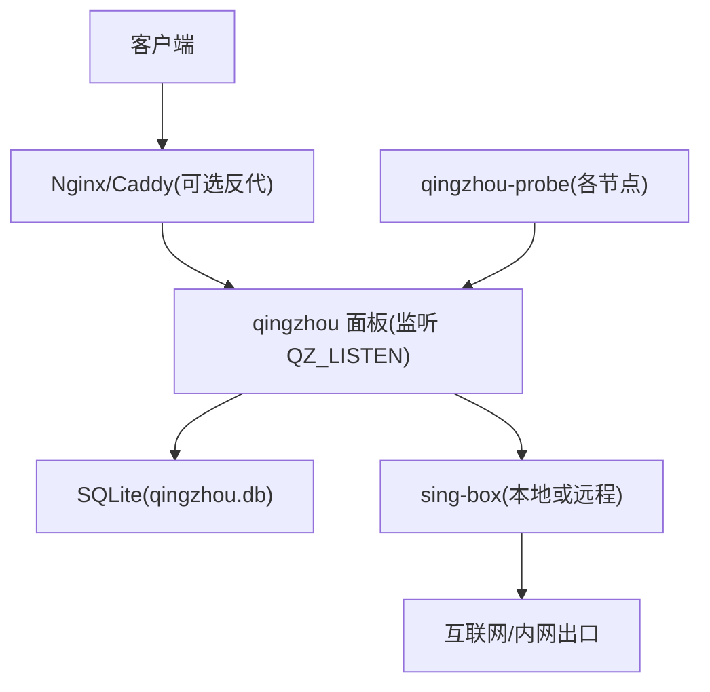
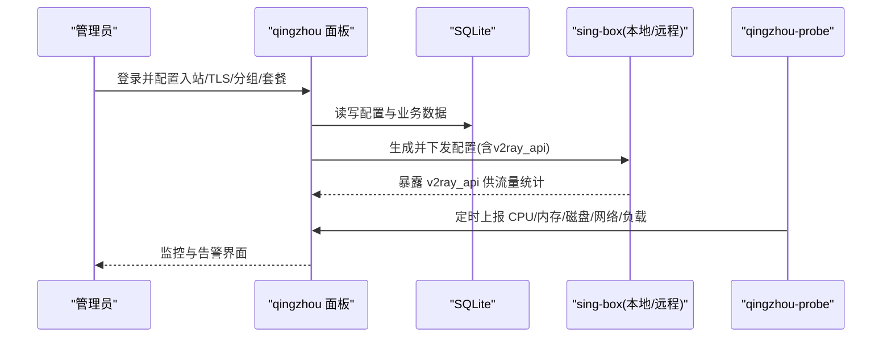
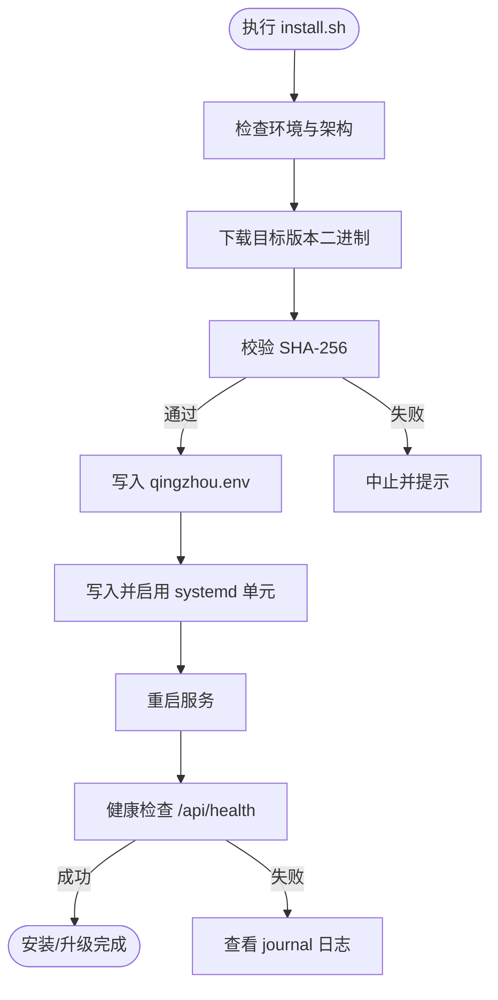
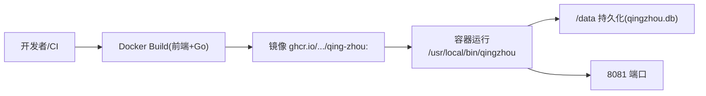
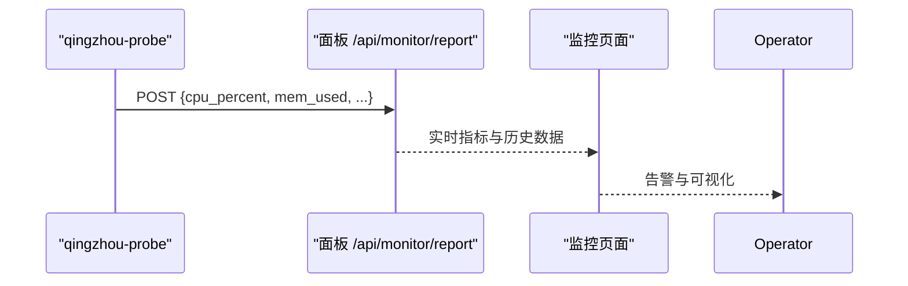
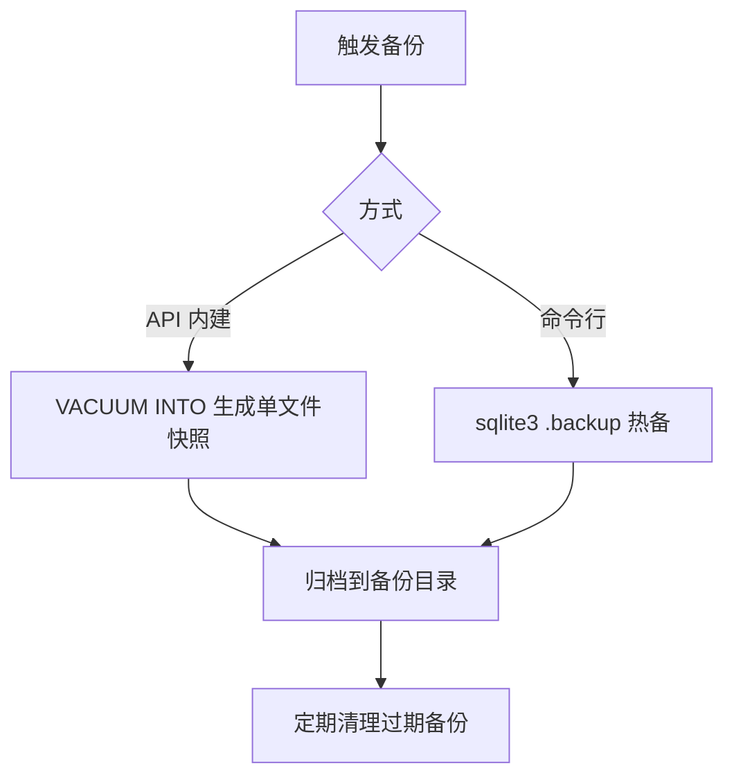
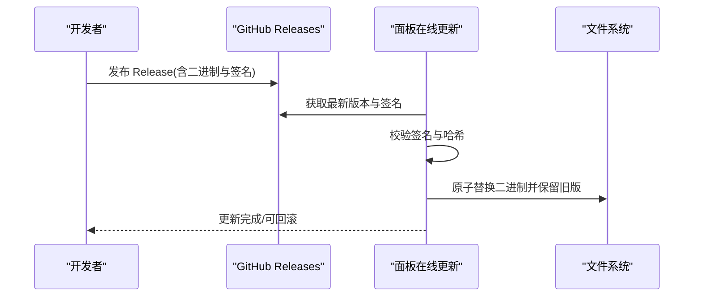
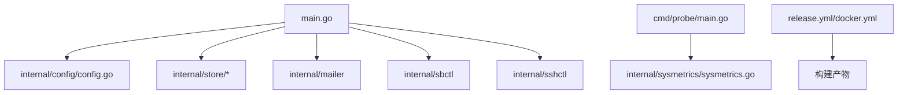

# 部署运维

<cite>
**本文引用的文件**
- [main.go](file://main.go)
- [Dockerfile](file://Dockerfile)
- [docker-compose.yml](file://docker-compose.yml)
- [install.sh](file://install.sh)
- [deploy/qingzhou.env.example](file://deploy/qingzhou.env.example)
- [deploy/qingzhou.service](file://deploy/qingzhou.service)
- [deploy/backup.sh](file://deploy/backup.sh)
- [internal/config/config.go](file://internal/config/config.go)
- [cmd/probe/main.go](file://cmd/probe/main.go)
- [internal/sysmetrics/sysmetrics.go](file://internal/sysmetrics/sysmetrics.go)
- [internal/store/backup.go](file://internal/store/backup.go)
- [internal/updater/updater.go](file://internal/updater/updater.go)
- [.github/workflows/release.yml](file://.github/workflows/release.yml)
- [.github/workflows/docker.yml](file://.github/workflows/docker.yml)
- [docs/部署与配置手册.md](file://docs/部署与配置手册.md)
</cite>

## 目录
1. [简介](#简介)
2. [项目结构](#项目结构)
3. [核心组件](#核心组件)
4. [架构总览](#架构总览)
5. [详细组件分析](#详细组件分析)
6. [依赖关系分析](#依赖关系分析)
7. [性能考虑](#性能考虑)
8. [故障排查指南](#故障排查指南)
9. [结论](#结论)
10. [附录](#附录)

## 简介
本指南面向生产环境的轻舟面板（QingZhou）部署与运维，覆盖单机、Docker 容器化、Kubernetes 集群三种部署方式；提供环境要求、最佳实践、监控与日志方案、备份恢复与数据持久化、自动更新与版本管理、容量规划与性能调优、安全加固与合规建议，以及常见问题的排障方法。内容基于仓库内源码与脚本实现，确保可落地、可追溯。

## 项目结构
- 单二进制 Go 程序：内置前端资源与 SQLite 数据库，负责用户、套餐、订阅、统计、可视化管理。
- 流量承载由 sing-box 进程完成，面板通过 v2ray_api 采集每用户流量并下发配置。
- 探针 qingzhou-probe 用于上报节点系统指标（CPU/内存/磁盘/网络/负载等）。
- 提供一键安装脚本、systemd 单元、Dockerfile、Compose、CI/CD 流水线等运维资产。

图表来源
- [main.go:108-121](file://main.go#L108-L121)
- [internal/config/config.go:14-28](file://internal/config/config.go#L14-L28)
- [Dockerfile:45-54](file://Dockerfile#L45-L54)
- [cmd/probe/main.go:75-91](file://cmd/probe/main.go#L75-L91)

章节来源
- [docs/部署与配置手册.md:5-11](file://docs/部署与配置手册.md#L5-L11)
- [main.go:25-142](file://main.go#L25-L142)
- [internal/config/config.go:14-28](file://internal/config/config.go#L14-L28)

## 核心组件
- 服务入口与生命周期：加载配置、打开数据库、迁移与种子数据、初始化邮件与 sing-box 控制器、启动后台任务、HTTP 服务器、优雅关闭。
- 配置加载：默认监听 0.0.0.0:8081，可通过环境变量覆盖；数据库路径默认相对工作目录。
- 探针：定时采集系统指标并通过 HTTP POST 上报到面板 /api/monitor/report。
- 备份：支持在线热备（VACUUM INTO）与命令行 .backup 两种一致性快照方式。
- 在线更新：从 GitHub Release 下载、校验签名与哈希、原子替换、保留旧版以便回滚。

章节来源
- [main.go:25-142](file://main.go#L25-L142)
- [internal/config/config.go:14-28](file://internal/config/config.go#L14-L28)
- [cmd/probe/main.go:34-91](file://cmd/probe/main.go#L34-L91)
- [internal/store/backup.go:10-51](file://internal/store/backup.go#L10-L51)
- [internal/updater/updater.go:518-546](file://internal/updater/updater.go#L518-L546)

## 架构总览
轻舟面板作为“中心机”，通过 SSH 管理远程落地 sing-box；本机也可同时运行 sing-box。面板生成 sing-box 配置并下发，通过 v2ray_api 采集每用户流量。探针在各节点上报系统指标，面板统一展示与告警。

图表来源
- [main.go:85-106](file://main.go#L85-L106)
- [cmd/probe/main.go:75-91](file://cmd/probe/main.go#L75-L91)
- [internal/singbox/generate.go:137-172](file://internal/singbox/generate.go#L137-L172)

## 详细组件分析

### 单机部署（systemd + 一键脚本）
- 使用 install.sh 进行全新安装或原地升级，自动识别架构、下载 release、校验 SHA-256、引导配置、写入 systemd 并启动。
- 配置文件位于 /opt/qingzhou/qingzhou.env，权限 600；systemd 单元参考 deploy/qingzhou.service。
- 监听地址选择：直连公网选 0.0.0.0:8081；有反代选 127.0.0.1:8081。
- 探针二进制托管：可选择在面板机托管 probe-linux-amd64/arm64，设置 QZ_PROBE_DIR 后节点可从面板下载。

图表来源
- [install.sh:151-193](file://install.sh#L151-L193)
- [install.sh:195-215](file://install.sh#L195-L215)
- [install.sh:217-311](file://install.sh#L217-L311)
- [install.sh:348-366](file://install.sh#L348-L366)

章节来源
- [install.sh:15-17](file://install.sh#L15-L17)
- [install.sh:85-101](file://install.sh#L85-L101)
- [install.sh:195-215](file://install.sh#L195-L215)
- [install.sh:217-311](file://install.sh#L217-L311)
- [install.sh:348-366](file://install.sh#L348-L366)
- [deploy/qingzhou.service:1-22](file://deploy/qingzhou.service#L1-L22)
- [deploy/qingzhou.env.example:1-43](file://deploy/qingzhou.env.example#L1-L43)

### Docker 容器化部署
- 多阶段构建：Node 构建前端 → Go 交叉编译二进制（含两架构探针）→ Alpine 运行镜像。
- 环境变量：QZ_LISTEN、QZ_DB、QZ_PROBE_DIR 等；默认暴露 8081；/data 卷持久化数据库。
- Compose 示例：映射端口、挂载命名卷、设置必要环境变量。

图表来源
- [Dockerfile:9-34](file://Dockerfile#L9-L34)
- [Dockerfile:36-54](file://Dockerfile#L36-L54)
- [docker-compose.yml:10-37](file://docker-compose.yml#L10-L37)

章节来源
- [Dockerfile:9-54](file://Dockerfile#L9-L54)
- [docker-compose.yml:1-37](file://docker-compose.yml#L1-L37)

### Kubernetes 集群部署
- 将容器镜像作为 Deployment 的 Pod 模板，使用 ConfigMap/Secret 注入环境变量（如 QZ_PUBLIC_BASE、QZ_SECRET_KEY、SMTP 等）。
- 使用 PersistentVolumeClaim 挂载 /data 以持久化 qingzhou.db。
- 通过 Ingress 暴露 8081 端口并配置 TLS 终止；若面板监听 127.0.0.1:8081，Ingress 反向代理至该端口。
- 使用 Readiness/Liveness Probe 调用 /api/health 或 HTTP 根路径进行健康检查。
- 如需探针，可在每个 Node 上以 DaemonSet 形式部署 qingzhou-probe，或通过 Sidecar 模式收集宿主机指标。

说明：本节为概念性部署指导，未直接映射具体代码文件。

### 服务监控与日志收集
- 探针上报：qingzhou-probe 定时读取系统指标并通过 HTTP POST 上报到面板 /api/monitor/report。
- 指标模型：包含 CPU、内存、Swap、磁盘、网络、负载、TCP 连接数、进程数、运行时长、平台信息等。
- 面板展示：监控页面聚合多节点指标，支持仪表盘、趋势图与热力图。
- 日志：systemd 日志通过 journalctl 查看；容器日志通过 docker logs 或 kube logs 收集；建议接入集中式日志系统（如 Loki/ELK）。

图表来源
- [cmd/probe/main.go:75-91](file://cmd/probe/main.go#L75-L91)
- [internal/sysmetrics/sysmetrics.go:16-38](file://internal/sysmetrics/sysmetrics.go#L16-L38)

章节来源
- [cmd/probe/main.go:34-91](file://cmd/probe/main.go#L34-L91)
- [internal/sysmetrics/sysmetrics.go:16-38](file://internal/sysmetrics/sysmetrics.go#L16-L38)

### 备份恢复策略与数据持久化
- 在线热备：面板内部提供 VACUUM INTO 的一致性快照，避免 WAL 不一致问题。
- 命令行热备：使用 sqlite3 .backup 对运行中的数据库进行热备，适合 cron 定时任务。
- 保留策略：按天归档并清理过期备份（例如保留 7 天）。
- 恢复：将备份文件替换为当前 qingzhou.db 或在面板中导入（根据实际流程）。

图表来源
- [internal/store/backup.go:10-51](file://internal/store/backup.go#L10-L51)
- [deploy/backup.sh:1-15](file://deploy/backup.sh#L1-L15)

章节来源
- [internal/store/backup.go:10-51](file://internal/store/backup.go#L10-L51)
- [deploy/backup.sh:1-15](file://deploy/backup.sh#L1-L15)

### 自动更新机制与版本管理
- CI/CD：release 工作流构建面板与探针二进制，附带签名与 SHA256SUMS；docker 工作流构建并推送多架构镜像。
- 面板在线更新：从 GitHub Release 下载新版本，校验签名与哈希，原子替换并保留旧版以便回滚。
- 版本注入：构建时注入版本号，便于在线更新比较与显示。

图表来源
- [.github/workflows/release.yml:81-175](file://.github/workflows/release.yml#L81-L175)
- [.github/workflows/docker.yml:22-74](file://.github/workflows/docker.yml#L22-L74)
- [internal/updater/updater.go:518-546](file://internal/updater/updater.go#L518-L546)

章节来源
- [.github/workflows/release.yml:81-175](file://.github/workflows/release.yml#L81-L175)
- [.github/workflows/docker.yml:22-74](file://.github/workflows/docker.yml#L22-L74)
- [internal/updater/updater.go:518-546](file://internal/updater/updater.go#L518-L546)

### 容量规划与性能调优建议
- 监听与反代：生产建议使用 Nginx/Caddy 反代并开启 HTTPS；面板监听 127.0.0.1:8081 更安全。
- 数据库：SQLite 在 WAL 模式下并发写能力有限，建议控制并发请求与定期备份；必要时评估迁移至外部数据库。
- sing-box：确保节点 sing-box 版本满足最低要求，开启 v2ray_api 以正确计量流量；合理配置协议组合（Reality/Hysteria2/TUIC）。
- 探针：调整采集间隔与阈值，避免高频上报造成面板压力。
- 资源限制：容器与 K8s 中设置合理的 CPU/Memory 限制与请求值；使用 HPA 基于 CPU/内存/自定义指标扩缩容。

[本节为通用指导，不直接引用具体代码文件]

### 安全加固与合规要求
- 敏感密钥：QZ_SECRET_KEY 应置于环境变量且不在数据库中；JWT 密钥由程序首次启动自动生成并存入数据库。
- 最小权限：systemd 单元启用 NoNewPrivileges=true 与 ProtectSystem=full；容器以非 root 用户运行。
- 传输安全：强制 HTTPS；反代层配置证书与严格的安全头；探针可使用 -insecure 仅用于本地测试。
- 访问控制：限制面板访问来源（防火墙/安全组），仅在可信代理前暴露；设置 QZ_TRUSTED_PROXIES 以正确获取真实客户端 IP。
- 合规：备份与日志需遵循企业留存策略；证书与私钥加密存储，禁止明文入库。

章节来源
- [main.go:51-71](file://main.go#L51-L71)
- [deploy/qingzhou.service:12-18](file://deploy/qingzhou.service#L12-L18)
- [cmd/probe/main.go:64-73](file://cmd/probe/main.go#L64-L73)
- [internal/api/admin.go:13-32](file://internal/api/admin.go#L13-L32)

## 依赖关系分析
- 主程序依赖：配置加载、数据库、邮件、sing-box 控制器、SSH 管理、探针目录等。
- 探针依赖：系统指标采集库 sysmetrics，HTTP 客户端上报。
- 构建与发布：前端构建产物嵌入二进制；release 与 docker 工作流产出多架构镜像与二进制。

图表来源
- [main.go:14-23](file://main.go#L14-L23)
- [cmd/probe/main.go:12-25](file://cmd/probe/main.go#L12-L25)
- [.github/workflows/release.yml:81-175](file://.github/workflows/release.yml#L81-L175)
- [.github/workflows/docker.yml:22-74](file://.github/workflows/docker.yml#L22-L74)

章节来源
- [main.go:14-23](file://main.go#L14-L23)
- [cmd/probe/main.go:12-25](file://cmd/probe/main.go#L12-L25)
- [.github/workflows/release.yml:81-175](file://.github/workflows/release.yml#L81-L175)
- [.github/workflows/docker.yml:22-74](file://.github/workflows/docker.yml#L22-L74)

## 性能考虑
- 减少不必要的重建：面板每次改动会重建 sing-box 配置，注意批量操作与定时重建窗口。
- 合理设置采集间隔：探针 interval 不宜过小，避免频繁 IO 与网络开销。
- 数据库维护：定期备份与优化（VACUUM），避免 WAL 膨胀影响性能。
- 网络栈调优：内核参数（BBR、缓冲区、somaxconn 等）已在安装脚本中应用，可按场景微调。
- 资源配额：容器/K8s 中设置合理的 requests/limits，结合 HPA/VPA 动态调整。

[本节为通用指导，不直接引用具体代码文件]

## 故障排查指南
- 面板无法访问：检查 QZ_LISTEN 是否为回环地址且未配置反代；确认安全组与防火墙放行端口。
- 修改不生效：面板会重建配置；后台也有定时重建任务，等待约 1 分钟或手动重试。
- 落地下发失败：查看链路拓扑页的错误原因（SSH 连通性、sing-box check 失败等），必要时一键重装节点 sing-box。
- 统计无数据：确认节点 sing-box 是否包含 with_v2ray_api；核对 QZ_SINGBOX_V2RAY 与配置一致。
- sing-box 启动失败：journalctl -u sing-box 查看日志或使用 sing-box check 验证配置。
- 客户端订阅报错：客户端需 ≥ 1.12；旧写法在 1.14 上可能直接加载失败，面板已自动改写模板。
- 升级后面板起不来：使用在线更新页的回滚功能，或指定历史版本安装。

章节来源
- [docs/部署与配置手册.md:237-261](file://docs/部署与配置手册.md#L237-L261)

## 结论
轻舟面板提供完整的订阅管理与节点编排能力，配合 sing-box 与探针形成可观测、可更新的运维闭环。通过一键脚本、Docker/K8s 与 CI/CD，可实现标准化部署与自动化更新；结合备份、监控与安全加固，满足生产环境的稳定性与合规要求。建议在生产环境中采用反代 HTTPS、最小权限、密钥外置、定期备份与灰度更新等最佳实践。

## 附录
- 环境变量参考：QZ_LISTEN、QZ_DB、QZ_PUBLIC_BASE、QZ_SECRET_KEY、QZ_ADMIN_USER/PASS、QZ_SMTP_*、QZ_PROBE_DIR、QZ_UPDATE_REPO 等。
- 常用命令：systemctl status/restart qingzhou；journalctl -u qingzhou -f；sqlite3 热备；面板在线更新与回滚。
- 参考文档：部署与配置手册、环境变量示例、systemd 单元、备份脚本。

章节来源
- [deploy/qingzhou.env.example:1-43](file://deploy/qingzhou.env.example#L1-L43)
- [deploy/qingzhou.service:1-22](file://deploy/qingzhou.service#L1-L22)
- [deploy/backup.sh:1-15](file://deploy/backup.sh#L1-L15)
- [docs/部署与配置手册.md:58-131](file://docs/部署与配置手册.md#L58-L131)
