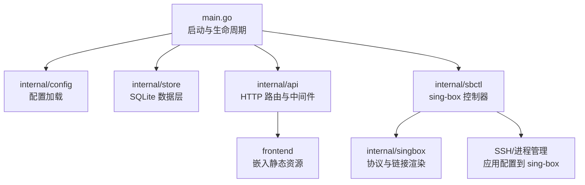
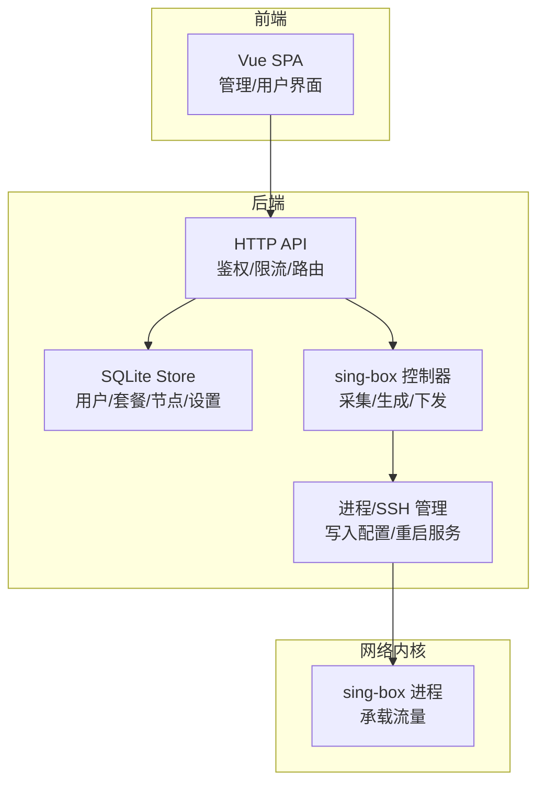
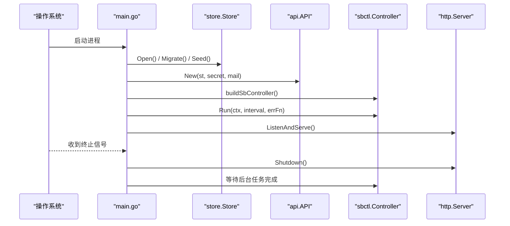
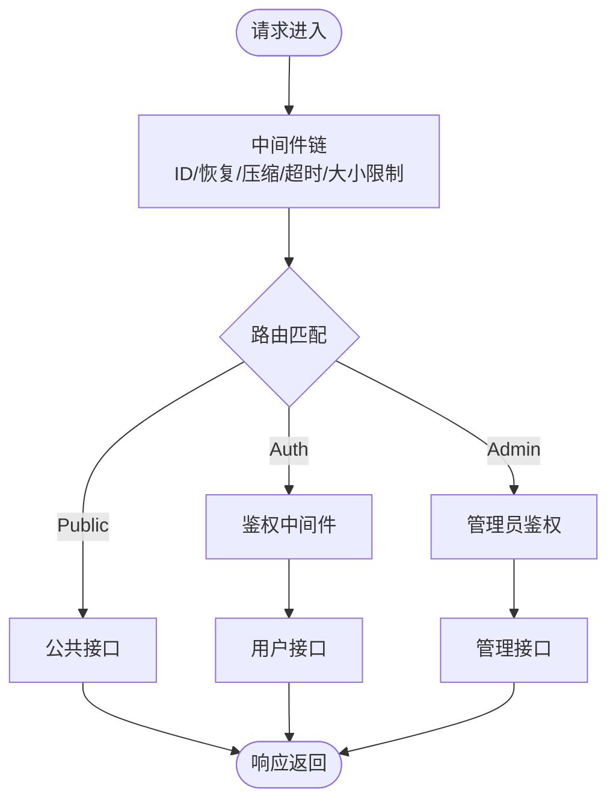
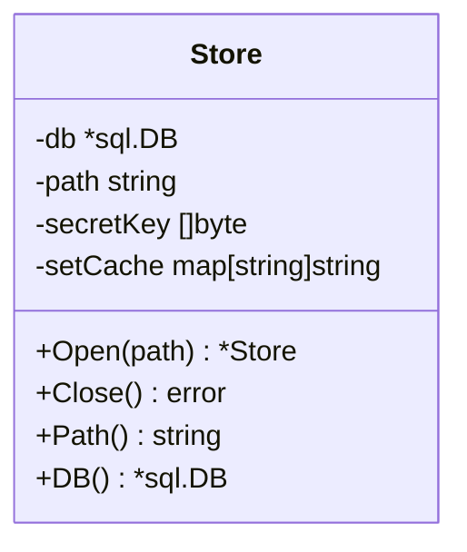
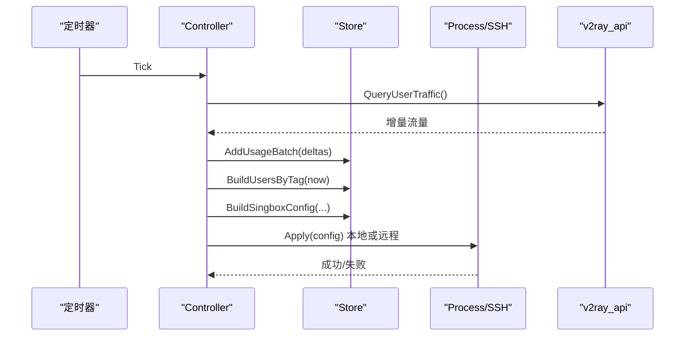
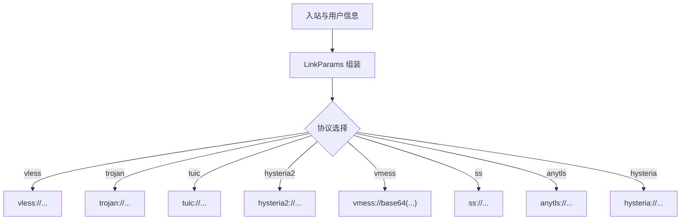
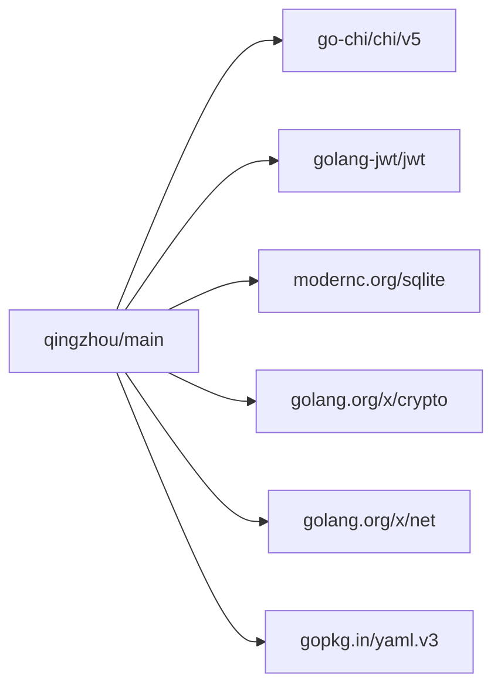

# 项目概述

<cite>
**本文引用的文件**
- [main.go](file://main.go)
- [go.mod](file://go.mod)
- [internal/config/config.go](file://internal/config/config.go)
- [internal/api/router.go](file://internal/api/router.go)
- [internal/store/store.go](file://internal/store/store.go)
- [internal/sbctl/controller.go](file://internal/sbctl/controller.go)
- [internal/singbox/link.go](file://internal/singbox/link.go)
- [internal/store/nodes.go](file://internal/store/nodes.go)
- [frontend/package.json](file://frontend/package.json)
- [docs/部署与配置手册.md](file://docs/部署与配置手册.md)
</cite>

## 目录
1. [简介](#简介)
2. [项目结构](#项目结构)
3. [核心组件](#核心组件)
4. [架构总览](#架构总览)
5. [详细组件分析](#详细组件分析)
6. [依赖关系分析](#依赖关系分析)
7. [性能考量](#性能考量)
8. [故障排查指南](#故障排查指南)
9. [结论](#结论)
10. [附录：快速开始](#附录快速开始)

## 简介
轻舟面板是一个基于 Go 语言的全栈代理节点管理系统，提供后端服务、内置前端管理界面以及系统集成能力。它负责用户与套餐管理、订阅生成、实时监控告警、自动化部署与证书管理，并通过 sing-box 承载实际流量。系统采用前后端分离设计，后端以单进程 HTTP API 为核心，结合 SQLite 存储；前端为 Vue + Vite 构建的 SPA，并嵌入到后端二进制中统一分发。整体遵循“微服务思想”的模块化组织：控制器、数据层、协议渲染、进程编排、监控采集等职责清晰解耦，便于扩展与维护。

核心价值与目标
- 一体化交付：单文件可执行，内置前端与脚本，降低运维复杂度
- 多落地节点编排：通过 SSH 远程下发 sing-box 配置，支持多级中转与第三方出口
- 自助服务：用户注册、购买套餐、获取订阅链接与二维码
- 实时统计与配额控制：按用户维度采集流量，自动裁剪越权访问
- 安全加密：敏感配置落库加密、TLS/Reality 证书统一管理、自动续期
- 可观测性：探针上报、监控大盘、告警阈值与可视化

适用场景与目标用户
- 个人或小团队搭建轻量级代理平台
- 需要多节点、多协议、多级中转的运营场景
- 希望以订阅方式向用户提供便捷接入体验
- 需要集中化证书管理与自动化部署的运维团队

## 项目结构
仓库采用分层与按功能域组织的混合结构：
- cmd/probe：探针程序（可选），用于上报节点资源指标
- frontend：Vue 前端工程，Vite 构建，包含路由、视图、状态管理、图表等
- internal：Go 后端核心逻辑，包括 API 路由、配置加载、数据存储、sing-box 控制器、证书与链路拓扑、更新器等
- deploy：systemd 单元与备份脚本等部署辅助
- docs：部署与配置手册
- 根目录：入口 main.go、Dockerfile、docker-compose.yml、安装脚本等

图示来源
- [main.go:25-142](file://main.go#L25-L142)
- [internal/config/config.go:14-29](file://internal/config/config.go#L14-L29)
- [internal/api/router.go:132-386](file://internal/api/router.go#L132-L386)
- [internal/sbctl/controller.go:357-455](file://internal/sbctl/controller.go#L357-L455)

章节来源
- [main.go:25-142](file://main.go#L25-L142)
- [internal/config/config.go:14-29](file://internal/config/config.go#L14-L29)
- [internal/api/router.go:132-386](file://internal/api/router.go#L132-L386)

## 核心组件
- 启动与生命周期管理：加载配置、打开数据库、初始化种子数据、启用邮件、创建 API、启动 sing-box 控制器与后台任务、优雅关闭
- 配置中心：环境变量优先，提供监听地址、数据库路径、管理员账号等默认值
- 数据层：SQLite 持久化，WAL 模式、连接池、设置缓存、并发安全
- API 网关：基于 chi 的路由，鉴权、限流、压缩、超时、最大请求体限制，公共/认证/管理三类接口
- sing-box 控制器：周期采集流量、生成配置、校验并应用到本地或远程节点，支持队列合并与状态追踪
- 协议渲染：根据入站与用户权限生成各协议的分享链接与订阅内容
- 前端 SPA：Vue + Naive UI + ECharts，提供管理控制台与用户自助页面

章节来源
- [main.go:25-142](file://main.go#L25-L142)
- [internal/config/config.go:14-29](file://internal/config/config.go#L14-L29)
- [internal/store/store.go:27-57](file://internal/store/store.go#L27-L57)
- [internal/api/router.go:132-386](file://internal/api/router.go#L132-L386)
- [internal/sbctl/controller.go:661-699](file://internal/sbctl/controller.go#L661-L699)
- [internal/singbox/link.go:206-418](file://internal/singbox/link.go#L206-L418)
- [frontend/package.json:1-27](file://frontend/package.json#L1-L27)

## 架构总览
轻舟面板采用“单进程 + 多模块”的架构，将业务逻辑拆分为独立包，通过接口组合形成可测试、可扩展的系统。前后端分离体现在前端作为静态资源被后端嵌入，API 暴露给浏览器与管理端使用。sing-box 作为独立的网络内核进程，由面板通过控制器进行配置生成与应用。

图示来源
- [internal/api/router.go:132-386](file://internal/api/router.go#L132-L386)
- [internal/store/store.go:27-57](file://internal/store/store.go#L27-L57)
- [internal/sbctl/controller.go:357-455](file://internal/sbctl/controller.go#L357-L455)

## 详细组件分析

### 启动与生命周期（main）
- 读取配置、打开数据库、迁移与种子数据
- 初始化 JWT 密钥与敏感配置加密主密钥
- 构建邮件发送器、API、sing-box 控制器
- 启动后台任务：源同步、维护、监控任务、证书续期、队列推进
- 启动 HTTP 服务器，监听端口，处理信号优雅退出

图示来源
- [main.go:25-142](file://main.go#L25-L142)

章节来源
- [main.go:25-142](file://main.go#L25-L142)

### API 路由与中间件
- 公共接口：健康检查、配置、验证、订阅地址
- 认证接口：登录、注册、忘记密码、重置密码（IP 限流）
- 探针接口：上报、下载探针与安装脚本（Token 鉴权 + 限流）
- 用户接口：仪表盘、套餐、订阅、节点管理、订单、积分、公告等
- 管理接口：设置、备份、重建、证书、入站/出站、服务器管理、监控、节点/分组/源、用户/组、统计、注册码、公告等
- 中间件：请求 ID、恢复、压缩、超时、最大请求体限制、可信代理 IP

图示来源
- [internal/api/router.go:132-386](file://internal/api/router.go#L132-L386)

章节来源
- [internal/api/router.go:132-386](file://internal/api/router.go#L132-L386)

### 数据层（Store）
- 使用 SQLite WAL 模式提升并发读性能
- 连接池与事务策略避免死锁与忙冲突
- 设置表内存缓存，写时失效
- 提供用户、节点、套餐、订单、用量等完整 CRUD

图示来源
- [internal/store/store.go:10-71](file://internal/store/store.go#L10-L71)

章节来源
- [internal/store/store.go:27-57](file://internal/store/store.go#L27-L57)

### sing-box 控制器（Controller）
- Rebuild：从数据层构建用户授权映射，生成 sing-box 配置，校验后应用到本地或远程节点
- CollectStats：轮询本地与各远程节点的 v2ray_api，汇总增量并批量写入数据库
- Run：周期性采集与重建，保证越权用户及时下线
- 能力探测：检测远端是否具备 v2ray_api 插件，缓存结果避免频繁探测
- 异步调度：合并多次重建请求，记录每台机器的同步状态供 UI 查询

图示来源
- [internal/sbctl/controller.go:548-589](file://internal/sbctl/controller.go#L548-L589)
- [internal/sbctl/controller.go:357-455](file://internal/sbctl/controller.go#L357-L455)
- [internal/sbctl/controller.go:661-699](file://internal/sbctl/controller.go#L661-L699)

章节来源
- [internal/sbctl/controller.go:357-455](file://internal/sbctl/controller.go#L357-L455)
- [internal/sbctl/controller.go:548-589](file://internal/sbctl/controller.go#L548-L589)
- [internal/sbctl/controller.go:661-699](file://internal/sbctl/controller.go#L661-L699)

### 协议与订阅渲染（singbox）
- 支持多种协议：vless、trojan、tuic、hysteria2、vmess、shadowsocks、anytls、hysteria
- 参数丰富：TLS/Reality、SNI、指纹、ALPN、拥塞控制、0-RTT、传输层（ws/grpc/httpupgrade）、MPTCP/TFO、Multiplex/Brutal、UDP 标记等
- 生成标准分享链接与订阅格式，兼容主流客户端

图示来源
- [internal/singbox/link.go:206-418](file://internal/singbox/link.go#L206-L418)

章节来源
- [internal/singbox/link.go:206-418](file://internal/singbox/link.go#L206-L418)

### 节点与分组（Store）
- 节点模型：类型、名称、协议、绑定入站标签、分享链接、来源、排序、分组
- 分组模型：名称、描述、排序、创建时间
- 支持节点重排、分组成员关联、节点名映射到订阅备注

章节来源
- [internal/store/nodes.go:11-200](file://internal/store/nodes.go#L11-L200)

## 依赖关系分析
- 运行时依赖：chi/v5 路由、JWT、UUID、crypto、net、yaml、SQLite
- 间接依赖：humanize、isatty、strftime、bigfft、sys、text、libc、mathutil、memory
- 前端依赖：Vue、Naive UI、ECharts、Pinia、Vite、TypeScript

图示来源
- [go.mod:1-26](file://go.mod#L1-L26)

章节来源
- [go.mod:1-26](file://go.mod#L1-L26)

## 性能考量
- 数据库：WAL 模式 + 小连接池，减少写锁竞争与嵌套读死锁风险
- 请求处理：Gzip 压缩、超时与最大请求体限制，保护小机器资源
- 控制器：周期采集与重建，合并重复请求，避免阻塞 HTTP 响应
- 远程节点：并发下发与采集，单个不可达节点不阻塞其他节点
- 前端：按需加载图表与组件，减少首屏体积

[本节为通用指导，无需特定文件引用]

## 故障排查指南
- 面板无法访问：检查监听地址与反向代理配置，必要时调整 QZ_LISTEN
- 流量统计为 0：确认节点 sing-box 版本含 v2ray_api，并在服务器页重装至面板发布版本
- 配置下发失败：查看链路拓扑中的错误原因，重试下发或升级/降级 sing-box
- sing-box 启动失败：检查 journal 日志与配置文件校验输出
- 客户端导入报错：确保客户端版本满足要求，注意 DNS 写法变更
- 升级回滚：使用在线更新页的回滚功能，无需联网

章节来源
- [docs/部署与配置手册.md:237-261](file://docs/部署与配置手册.md#L237-L261)

## 结论
轻舟面板以简洁的单进程架构实现了强大的代理节点管理能力，覆盖从用户自助到运维编排的全流程。通过模块化设计与清晰的职责边界，系统在易用性与可维护性之间取得良好平衡。对于需要多节点、多协议与自动化部署的团队而言，它是一个高效可靠的解决方案。

[本节为总结性内容，无需特定文件引用]

## 附录：快速开始
- 安装 sing-box：在每台落地服务器上执行面板托管的安装脚本，自动安装指定版本并配置 systemd
- 部署面板：运行一键脚本或手动部署，配置环境变量与 systemd 服务
- 首次访问：创建管理员账号，配置服务器、TLS/Reality、入站、分组、套餐
- 接入节点：在服务器管理中填写安装脚本输出的信息，面板将通过 SSH 下发配置
- 用户自助：用户注册后在商城购买套餐，复制订阅链接或扫码导入客户端

章节来源
- [docs/部署与配置手册.md:14-131](file://docs/部署与配置手册.md#L14-L131)
